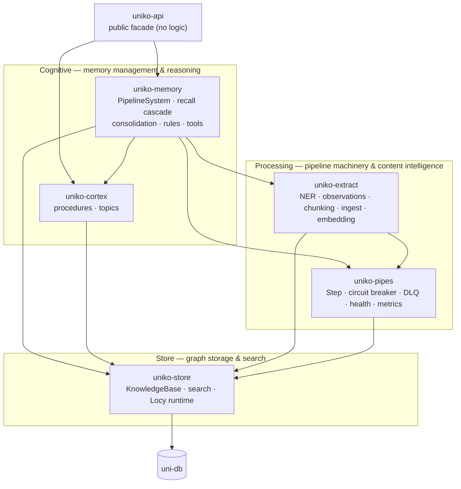
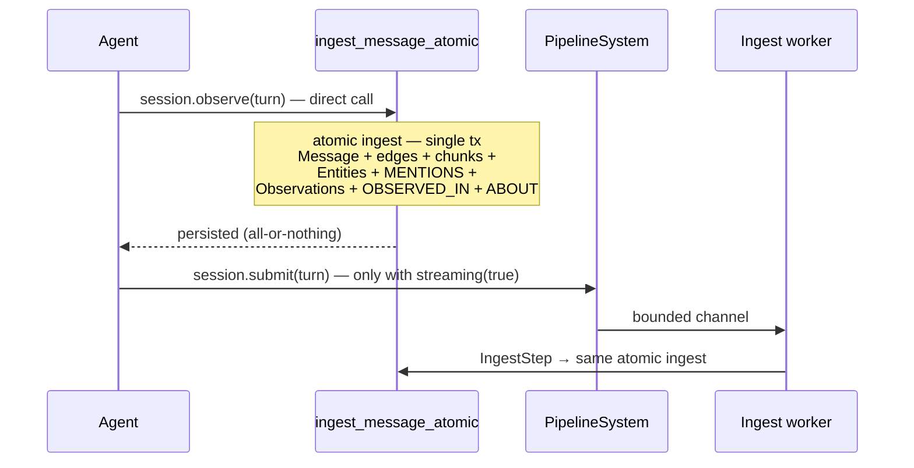

# Architecture

uniko keeps LLMs out of the write path and never collapses into one monolithic blob of code: ingest is fast and atomic, and reasoning happens later in background workers. It is a cognitive memory system built as a stack of Rust crates over uni-db, an embedded multi-model graph database, that turns raw conversation into *structured, searchable, reasoned-over* knowledge.

Two principles, kept deliberately separate, make that possible:

1. **Cognitive altitude** — how much *meaning* a layer understands. The store knows nodes and edges; it does not know what an Observation is. Higher crates add interpretation.
2. **Latency budget** — what runs *synchronously* on the write path versus what runs *later* in background workers.

This page walks the crate layering top-to-bottom, then the two-part ingest flow that ties them together.

## The crate stack

The workspace ([`Cargo.toml`](https://github.com/rustic-ai/uniko/blob/main/Cargo.toml)) is a strict, mostly-linear dependency graph. Each crate adds exactly one category of capability, and each can only call the crates below it.

!!! note "Layer numbers are cognitive altitude, not build order"
    Layer numbers rank *meaning*, not dependency direction. The crate doc comments label `uniko-cortex` as "Layer 5" and `uniko-memory` as "Layer 4", yet `uniko-memory` *depends on* `uniko-cortex` by design: cortex's procedure promotion and topic detection (P5/P6) are **subscribers** to consolidation (P4, the heartbeat), which lives in memory. The consolidation worker drives cortex sweeps after successful cycles, so memory depends on cortex — not the other way around. In the actual build graph, cortex is a *sibling* of extract: both depend only on `uniko-store`.

### uniko-store — graph storage, search, Locy runtime

The lowest layer. It wraps uni-db to provide typed graph storage, search (vector, full-text, hybrid), and the Locy logic runtime. It knows nodes, edges, and embeddings — but nothing about what they *mean*.

The central type is [`KnowledgeBase`](../reference/api.md), the typed handle every higher crate uses. Its modules cover storage (`operations` for writes, `repository` for decoded reads), `search`, `schema`, `locy`, `model` (model-runtime access), `blob_store`, `locks`, and `id` generation.

!!! tip "Clean API boundary"
    uni-db is an implementation detail. The product crates — `uniko-{memory,extract,cortex,pipes}` — reach the graph through `uniko-store`'s typed API, and a CI grep gate enforces it by forbidding `use uni_db` in their `src/`. The few uni-db value types higher crates need (`Value`, `Transaction`, `temporal::Btic`, `xervo::{GenerationOptions, Message}`) are re-exported from `uniko-store`, so callers write `use uniko_store::Value;`. The payoff: the rest of the system is insulated from database internals.

A second re-export, `ModelRuntime` (from `uni-xervo`), lets multi-KnowledgeBase workflows share one ONNX session via `KnowledgeBase::build_shared_runtime` and `open_with_runtime`.

### uniko-pipes — pipeline infrastructure

Layer 2, depending on `uniko-store` only. This crate is *generic* pipeline machinery with no content knowledge:

- [`Step`](../pipelines/index.md) — the trait every processing stage implements, plus `PipelineContext` carrying per-item state.
- `CircuitBreaker` / `CircuitState` — trips background LLM calls open on repeated failure.
- `DeadLetterQueue` — captures items that exhaust retries.
- `ShutdownCoordinator` — cooperative cancellation across workers.
- `health` and `metrics` — per-worker status and Prometheus-exportable counters.
- Task and result types: `IngestTask`, `IngestMessage`, `IngestArtifact`, `IngestPdf`, `ConsolidationTask`, `ObservationsReady`, `ItemResult`, `StepOutcome`, `StepErrorPolicy`, `PipelineConfig`.

The actual content-processing steps live one layer up, in `uniko-extract`.

### uniko-extract — content processing

Layer 3, depending on `uniko-pipes` and `uniko-store` (plus `uni-db` and `uni-xervo` directly). This is where raw content becomes structured graph data. Its modules:

- `ner` — entity extraction (local ONNX NER, tree-sitter for code, rule-based fallback).
- `observations` — extracting factual statements from messages.
- `ingest` — the ingest pipeline itself, including the atomic per-message path (see below).
- `embedding` — embedding computation.
- `nlp` — NLP processing (present under the `onnx` feature).

`uniko-extract` implements the `Step` trait from `uniko-pipes` so its work slots into the pipeline. The headline entry point is `IngestStep`, which dispatches on the `ingest_type` metadata key to `ingest_message_atomic` (`"message"`), `ingest_artifact` (`"artifact"`), `ingest_pdf` (`"pdf"`), or the MIME-routed `ingest_source` (`"source"`); an unknown value is skipped rather than failed.

### uniko-memory — memory management & orchestration

The cognitive heart. It depends on `uniko-cortex`, `uniko-extract`, `uniko-pipes`, and `uniko-store`. Responsibilities:

- **`PipelineSystem`** — the root orchestrator. It owns all workers, bounded channels, the LLM circuit breaker, and worker handles; it is the single entry point for submitting ingest and consolidation tasks. Submission is non-blocking via bounded channels with backpressure.
- **Recall** (`recall`, `query`) — the 3-phase recall cascade with coverage gating and drift override; `answer_query`, `record_query_episode`.
- **Consolidation** (`consolidation`, `fact`) — fact derivation, contradiction handling, drift detection, and reinforcement/decay.
- **Subjective-state tools** (`action`, `agent`, `episode`, `goal`, `observation`, `task`, `summary`) — the things only an agent can decide to record: `record_episode`, `assert_fact`/`invalidate_fact`, `add_observation`, `create_goal`, `create_task`, `record_action`, `generate_session_summary`. The `Uniko` facade surfaces goals/tasks through `agent.goals()` and by-id retrieval through `agent.data()`.
- **Rules** (`rules`) and **policy** (`policy`).
- **`nl_to_cypher`** — natural-language-to-Cypher translation.

!!! note "NL-to-Cypher produces a guarded, read-only query"
    `nl_to_cypher::translate` (F61) asks the configured LLM (a Xervo alias) to turn a question into Cypher, rejects any mutating output via `is_safe_read_only`, and returns the query **string** — running it is the caller's responsibility. The translator never executes the query itself, and it is unrelated to the Locy rule engine (it only reuses `UnikoError::Locy` as an error variant).

### uniko-cortex — higher reasoning

Procedures and topics — the patterns consolidation surfaces over time. Two modules:

- `procedures` — `promote_procedures_once`, `match_procedures`, `record_procedure_use`, plus `LifecycleConfig`, `MatchedProcedure`, `PromotionReport`.
- `topics` — `detect_topics_once` / `detect_topics_once_with_llm`, with `TopicConfig` and `TopicReport`.

It depends on `uniko-store` only. The consolidation worker in `uniko-memory` calls `promote_procedures_once` and `detect_topics_once` after successful consolidation cycles.

### uniko-api — public facade

The agent-facing surface, containing **no logic** — only re-exports. The `Uniko` facade (`Uniko`, `Agent`, `Session`, `Turn`, `Data`, `Goals`, and the recall/answer types) is the single public entry point. Its `tools` module deliberately does **not** re-export the subjective-state free functions (`record_episode`, `assert_fact`, `add_observation`, `create_goal`, `create_task`, `record_action`, `generate_session_summary`) — a `compile_fail` guard pins this. Those operations are surfaced as `Agent` / `Session` methods instead, so the public surface never exposes a raw `&KnowledgeBase`. Among lower-level items, `tools` re-exports only `nl_to_cypher::is_safe_read_only` and `policy::{Viewer, visibility_admits}`, alongside the facade and intent types. The free functions remain available at the `uniko-memory` crate root. Downstream consumers depend on this crate rather than reaching into the cognitive stack directly.

### uniko-bench — benchmarks

The benchmark crate exercises the full stack end-to-end (LoCoMo, LongMemEval). It is one of the only consumers permitted to use `KnowledgeBase::db`, the `pub` escape hatch sealed off from product code.

## The two-part flow: atomic ingest vs async workers

The architecture's other axis is *latency*. uniko keeps the LLM out of the write path: anything an agent waits on is synchronous and cheap; anything that needs accumulation or background reasoning runs later in a worker.

!!! warning "The default path does not go through `PipelineSystem`"
    `session.observe()` calls `ingest_message_atomic` directly and commits before
    returning. `PipelineSystem` is constructed **only** when the instance was built with
    `.streaming(true)`, and is reachable only via `submit()` / `submit_source()`.

### Part 1 — atomic ingest (synchronous)

Per-message ingest is a **prep-then-commit** flow. All CPU work (NLP, NER, SRL, dedup) and read-only DB lookups happen *before* a transaction opens. Then a single transaction writes the Message plus its edges, Chunks, Entities, `MENTIONS` edges, Observations, and `OBSERVED_IN` / `ABOUT` edges — and commits once.

The semantics are **all-or-nothing**: any error during extraction or in-transaction writes aborts the call and the transaction is dropped without commit. There is no "Message persisted with no entities" half-state.

!!! tip "Why one transaction matters"
    Folding the legacy three-step path (`ingest_message`, entity extraction, observation extraction) into one transaction cut commits per message from 3 to 1, removing most of the measured commit-wait time. First-sight Session/Participant creation still uses its own commits.

### Part 2 — async post-ingest workers

Slower, accumulation-dependent work is designed to run in background workers owned by
`PipelineSystem`:

- The **consolidation worker** consumes `ConsolidationTask`s. On `ObservationsReady` it
  accumulates a per-agent observation counter and fires a cycle at a threshold (default 20)
  or on a periodic timer (default 15 minutes). A cycle derives Facts from Observations,
  reinforces or invalidates them, and detects drift.
- After every *successful* cycle, that same worker drives the **cortex sweep** — P5 procedure
  promotion and P6 topic detection — gated by a per-agent cycle counter
  (`cortex_cycle_every_n_consolidations`, default 4) and a per-sweep wall-clock minimum
  (`cortex_min_interval_secs`, default 600s). P5 is keyed per agent; P6 is global. Cortex
  failures are logged and dropped.

!!! tip "Two ways consolidation runs"
    **Explicitly** — `agent.consolidate()` runs one cycle on the calling task and returns
    `CycleStats`. Always available, no streaming required. This is the path to use when you
    want to decide the moment (end of a conversation, before a report, in a batch job).

    **Automatically** — an instance built with `.streaming(true)` owns a consolidation
    worker. Ingest notifies it as Observations land, and it fires on a per-agent threshold
    (20 new Observations) or a periodic timer (15 minutes), then runs the cortex sweep.

    A default (non-streaming) instance has no worker, so `consolidate()` is the only path
    there.

!!! tip "Offline-capable by default"
    The LLM is optional at every layer. Local NER and rule-based observation extraction keep ingest and recall running fully offline — this is the default path that produces uniko's benchmark numbers. The LLM-dependent extras are opt-in: triple refinement and topic naming degrade transparently to their local paths when the LLM is unavailable, but NL-to-Cypher has no offline fallback and errors instead. LLM enhancements (triple refinement, topic naming) are optional and asynchronous, never required for ingest.

## Where to go next

### [Pipelines](../pipelines/index.md)
The `Step` trait, circuit breaker, DLQ, and how the ingest and consolidation workers chain steps.

### [KnowledgeBase](../reference/api.md)
The typed handle that seals uni-db behind `uniko-store`.

