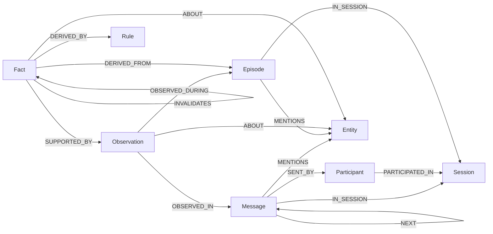

# Data Model

Every memory in uniko is a node or an edge in a single property graph. There is no
separate document store, vector store, or relational table sitting beside it — the graph
*is* the memory. When the system asks "what is true now?", "where did this come from?", or
"what happened in this session?", it answers by traversing edges, not by joining across
systems.

This page walks the node types, the edges that connect them, and the design rule that holds
the whole thing together. The names here are the real ones, registered by `uniko-store` when a
[KnowledgeBase](../reference/api.md) opens; the complete property-and-index catalogue lives in
[Reference > Schema](../reference/schema.md).

## The shape of the graph

uniko's schema registers **25 node types and 54 edge types** with the underlying uni-db
graph. They are organised into layers that map onto a cognitive-memory model — episodic
(what happened), semantic (what we know), procedural (what works), and the meta-memory that
tracks how knowledge was derived.

The single most important design rule is this:

!!! note "Knowledge is derived, never directly stored"
    Everything traces back to communication and action. A `Fact` does not appear from
    nowhere — it is consolidated from `Observation`s, each `Observation` is grounded in a
    `Message` or a `Chunk`, and every `Message` was sent by a `Participant`. Provenance is
    not a feature bolted on afterwards; it is the spine of the schema.

That spine starts at the `Message`.

## Message anchors everything

A `Message` is the atomic unit of communication — one thing someone said. It is the node
that the rest of the episodic graph hangs off. Its registered edges are deliberately few
and load-bearing:

```rust
// crates/uniko-store/src/schema/messages.rs — edge registration
builder
    .edge_type(edges::SENT_BY, &[labels::MESSAGE], &[labels::PARTICIPANT])
        .property_nullable("role", DataType::String)   // "user" | "assistant" | "system" | "tool"
        .done()
    .edge_type(edges::ADDRESSED_TO, &[labels::MESSAGE], &[labels::PARTICIPANT])
        .done()
    // IN_SESSION is multi-source: Message, Action and Episode all live in a Session
    .edge_type(edges::IN_SESSION,
        &[labels::MESSAGE, labels::ACTION, labels::EPISODE],
        &[labels::SESSION])
        .done()
    .edge_type(edges::NEXT, &[labels::MESSAGE], &[labels::MESSAGE])
        .property_nullable("gap_ms", DataType::Int64)   // wall-clock gap to the next turn
        .done()
```

From a single `Message` you can reach the `Participant` who sent it (`SENT_BY`), the
`Session` it belongs to (`IN_SESSION`), the chronological next turn (`NEXT`), and — once
extraction has run — every `Entity` it `MENTIONS`. Those four anchors are enough to
reconstruct a conversation, attribute statements to people, and walk time forward and back.

!!! tip "Participants are uniform"
    Humans, agents, and services are all the same `Participant` node, distinguished only by
    a `kind` field. A query for "what did Caroline say" and "what did the assistant do" walk
    the exact same edges.

## From messages to knowledge

Extraction and consolidation lift raw turns into reusable knowledge through three node types,
connected by provenance edges:

- **`Observation`** — a direct claim grounded in a source. *"Caroline attended an LGBTQ
  support group."* It carries `OBSERVED_IN` edges to the `Message` or `Chunk` it came from,
  `OBSERVED_DURING` to the `Episode`, and `ABOUT` to the `Entity` (or `Participant`) it
  concerns.
- **`Fact`** — consolidated from *multiple* observations over time. *"Caroline is pursuing
  adoption."* A `Fact` links back to its evidence via `SUPPORTED_BY` (to `Observation`s) and
  `DERIVED_FROM` (to the `Episode`s whose observations provided the evidence).
- **`Entity`** — a named thing (person, place, org, concept, tool…) that messages,
  chunks, actions, artifacts, and episodes all `MENTIONS`.

A `Fact` is not eternal. When new evidence contradicts an old belief, consolidation does not
delete the stale fact — it records the supersession explicitly:

```rust
// crates/uniko-store/src/schema/facts.rs — the INVALIDATES edge
.edge_type(edges::INVALIDATES, &[labels::FACT], &[labels::FACT])
    .property_nullable("reason", DataType::String)
    .property_nullable("invalidated_at", DataType::DateTime)
    .done()
```

The invalidated `Fact` keeps its history; its temporal validity simply closes. Validity
itself is stored on the `Fact` as a single `valid_at` property of type `Btic` — a half-open
interval `[lo, hi)` with per-bound certainty and granularity — so a question like "what was
true on March 15?" is answered by an interval-containment check rather than juggling separate
`valid_from`/`valid_until` columns. See [Facts & Drift](../concepts/facts-and-drift.md) for
how BTIC drives bitemporal recall.

!!! note "Multi-source edges are a feature: one relationship, many sources"
    Several edge types deliberately connect *many* source labels to a target, so a single
    relationship type works everywhere it makes sense. `MENTIONS` runs from `Message`,
    `Chunk`, `Action`, `Artifact`, **and** `Episode` to `Entity` — one edge for "references a
    named thing," wherever that reference appears. `DERIVED_FROM` runs from `Fact`,
    `Procedure`, and `Artifact` to `Episode`, `Action`, or another `Artifact`. When you write
    a Cypher pattern, match on the endpoint node, not just the edge type, so you land on
    exactly the label you intend.

## A representative slice



The diagram shows the load-bearing core. A `Message` (sent by a `Participant`, in a
`Session`) mentions `Entity`s; an `Observation` grounded in that message is consolidated into
a `Fact`, which knows the `Rule` that derived it and the `Fact` it replaced.

## Node types

A representative subset of the 25 registered node types. Each is registered by a module under
`crates/uniko-store/src/schema/`.

| Node | Layer | What it represents | Key properties |
|---|---|---|---|
| `Participant` | Participants | A human, agent, or service | `participant_id`, `kind`, `name` |
| `Goal` | Goals/Tasks/Sessions | A long-running objective | `goal_id`, `title`, `status` |
| `Task` | Goals/Tasks/Sessions | A unit of work toward a goal | `task_id`, `title`, `status`, `priority` |
| `Session` | Goals/Tasks/Sessions | A bounded interaction | `session_id`, `topic`, `started_at`, `ended_at` |
| `Message` | Episodic | Atomic unit of communication | `message_id`, `content`, `timestamp` |
| `Action` | Episodic | Something a participant did beyond talking | `action_id`, `action_type`, `status` |
| `Episode` | Episodic | A structured learning experience | `episode_id`, `action_type`, `outcome`, `importance` |
| `Artifact` | Artifacts | A file, document, URL, or other object | `artifact_id`, `kind`, `path` |
| `ArtifactContent` | Artifacts | Content-addressed blob metadata, deduped by hash | `content_id`, `mime`, `size` |
| `Chunk` | Artifacts | A retrievable slice of an artifact or long message | `chunk_id`, `text`, `index`, `chunk_type` |
| `Entity` | Semantic | A named thing mentioned anywhere | `entity_id`, `name`, `entity_type` |
| `Observation` | Semantic | A direct claim grounded in a source | `observation_id`, `content`, `subject`, `predicate` |
| `Fact` | Semantic | Knowledge consolidated from observations | `fact_id`, `subject`, `predicate`, `object`, `valid_at` |
| `Topic` | Semantic | An aggregated knowledge cluster | `topic_id`, `name`, `summary` |
| `Summary` | Semantic | A generated summary at some level | `summary_id`, `text`, `level` |
| `Procedure` | Procedural | A proven action sequence | `procedure_id`, `name`, `effectiveness`, `status` |
| `Rule` | Procedural | A Locy rule for formal reasoning | `rule_id`, `name`, `source`, `confidence` |
| `ConsolidationCycle` | Meta | A record of one consolidation run | `cycle_id`, `agent_id`, `started_at` |
| `Organization` / `Team` | Organization | Participant grouping | `org_id` / `team_id`, `name` |
| `KnowledgeBaseStats` | KB metadata | Singleton KB-level metadata (modality presence, blob backend) | `stats_id`, `modality_presence` |

!!! note "Five more nodes round out the 25"
    Beyond the table, the schema also registers `DeadLetter` (failed-pipeline-task tracking),
    `KnowledgeBaseStats`, `Page` (a single PDF page in the document-IR model), `Block`
    (an atomic content block within a `Page`), and `Pattern` (a recurring episode pattern
    surfaced by the `episode_pattern_detector` stdlib rule). The full
    property and index list for every node type is in the
    [Schema reference](../reference/schema.md).

## Edge types

A representative subset of the 54 registered edge types. The full list, with source/target
labels and edge properties, is in the [Schema reference](../reference/schema.md).

| Edge | From → To | Meaning |
|---|---|---|
| `SENT_BY` | `Message → Participant` | Who said it (carries `role`) |
| `ADDRESSED_TO` | `Message → Participant` | Who it was directed at |
| `IN_SESSION` | `Message`, `Action`, `Episode → Session` | Which session it belongs to |
| `NEXT` | `Message → Message` | Chronological next turn (carries `gap_ms`) |
| `PARTICIPATED_IN` | `Participant → Session` | Who was in the session |
| `MENTIONS` | `Message`, `Chunk`, `Action`, `Artifact`, `Episode → Entity` | References a named entity |
| `HAS_CHUNK` | `Artifact`, `Message`, `Session`, `Block → Chunk` | Retrievable slices of content |
| `HAS_CONTENT` | `Artifact → ArtifactContent` | Link to the deduped blob |
| `OBSERVED_IN` | `Observation → Message`, `Chunk` | Source of an observation |
| `OBSERVED_DURING` | `Observation → Episode` | Episode in which it was observed |
| `ABOUT` | `Observation`, `Fact`, `Chunk → Entity`, `Participant` | What it concerns |
| `SUPPORTED_BY` | `Fact → Observation` | Evidence for a fact (carries `weight`) |
| `DERIVED_FROM` | `Fact`, `Procedure`, `Artifact → Episode`, `Action`, `Artifact` | Provenance of derived knowledge |
| `DERIVED_BY` | `Fact → Rule` | Which rule produced the fact |
| `INVALIDATES` | `Fact → Fact` | Newer fact supersedes an older one |
| `FOLLOWED_BY` | `Episode → Episode` | Temporal chain of experiences |
| `SUPERSEDES` | `Rule → Rule` | A newer rule replaces an older one |
| `SUMMARIZES` | `Summary → Session`/`Task`/`Goal`/`Artifact`/`Entity`/`Topic`… | What a summary covers |

## Working memory is a view, not a node

There is no `WorkingMemory` node type. Working memory is a *live view* computed on demand by
traversing the graph outward from a `Goal` — its `Task`s, the `Episode`s and `Session`s for
those tasks, recent `Message`s, the `Fact`s derived from those episodes, the `Entity`s
involved, and any proven `Procedure`s. Because the answer is recomputed from edges each time,
it always reflects the latest state of the graph rather than a cached snapshot.

## Where to go next

<div class="feature-grid" markdown>
<div class="feature-card" markdown>
### [Schema Reference](../reference/schema.md)
The complete catalogue: every node, every edge, every property and index.
</div>
<div class="feature-card" markdown>
### [Facts & Drift](../concepts/facts-and-drift.md)
How `valid_at` and BTIC intervals drive bitemporal recall.
</div>
<div class="feature-card" markdown>
### [Architecture](../concepts/architecture.md)
How the pipeline turns messages into the graph above.
</div>
<div class="feature-card" markdown>
### [Knowledge Base](../reference/api.md)
The handle that opens the graph and registers this schema.
</div>
</div>
