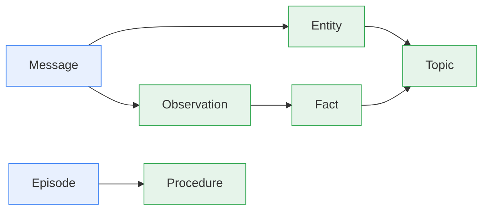

# Concepts Overview

A vector store hands an agent one undifferentiated pile of text. uniko gives it memory it can
reason over: a typed knowledge graph organized around **communication and goals**, where the
system knows the difference between what someone said, what was observed, what is true, and what
works. Every node traces back to the `Message` or `Action` that produced it, so an agent can
always answer *why* it believes something.

Everything an agent experiences is a communication event — a user speaks, an agent reports, a tool
returns output. These are **Messages**, the ground truth from which all other knowledge derives.

From that single foundation, uniko builds a layered cognitive stack. Entities
are extracted from Messages. Observations are the factual statements found in
them. Facts are consolidated from Observations over time, carrying temporal
validity so the system knows not just *what* it believes but *when* that belief
held. Procedures are promoted from repeated experience, and formal Locy Rules
execute reasoning inside the database itself.

## The mental model

uniko's design rests on three ideas that recur throughout these pages.

**Interaction-first.** Everything in the graph traces back to a Message or an
Action. The provenance chain is always: who said what, what was observed, what
was learned, and what works. You can always ask *why* a Fact exists and follow
the edges back to the source.

**Compile once, query forever.** Raw Messages are like source code.
Consolidation "compiles" them into Facts and Procedures. The recall cascade
queries the compiled knowledge, not the raw stream — the extraction cost is paid
once, and every subsequent query benefits.

**Goal-oriented.** Agents remember *for a purpose*. Working memory is not a chat
history; it is everything relevant to an active Goal, assembled on demand by
traversing the graph from Goal to Task to Session to Message to Fact to Entity.

!!! note "Five memory types"
    uniko implements five memory types from cognitive science: **Working
    Memory** (live goal context), **Episodic Memory** (Message, Action,
    Episode), **Semantic Memory** (Entity, Observation, Fact, Topic),
    **Procedural Memory** (Procedure, Rule), and **Meta-Memory**
    (ConsolidationCycle and the recall cascade). Each maps to concrete graph
    nodes.

## Core concepts (read in order)

### [Architecture](architecture.md)
The three-layer cognitive stack — Store, Processing, Cognitive — with uniko-api as the public facade above them, and the principle that data lives in one graph while crates depend strictly downward.

### [Memory Model](memory-model.md)
How the five cognitive memory types map to graph nodes, and how knowledge flows from raw communication to compiled facts and procedures.

### [Data Model](data-model.md)
The 25 node types and 54 edge types across 9 schema layers — Participants, Goals & Sessions, Episodic, Artifacts, Semantic, Procedural, Meta-Memory, Organization, and KB metadata.

### [Facts & Drift](facts-and-drift.md)
Bitemporal Facts with BTIC validity intervals, Laplace-smoothed confidence, contradiction-driven invalidation, and entity drift detection.

### [Visibility & Access](visibility.md)
How Fact visibility scopes a belief to a participant, team, or organization — or leaves it public — and the provenance edges that make every belief traceable.

!!! tip "Where to start"
    If you are new, read [Architecture](architecture.md) first to understand the
    layering, then [Data Model](data-model.md) to learn the vocabulary —
    Message, Observation, Fact, Entity, Procedure, and the rest — that the other
    pages assume.
