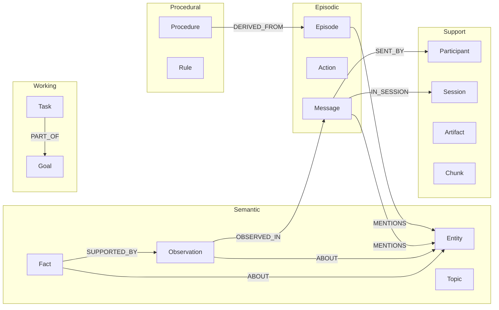
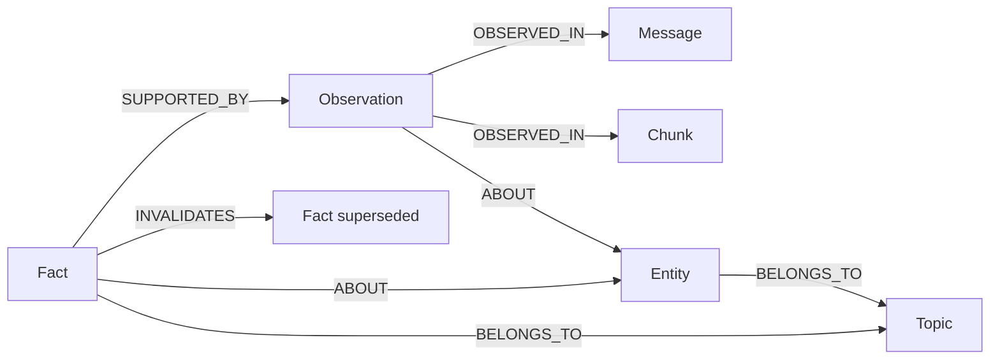

# Memory Model

A vector store gives an agent one undifferentiated pile of text. Every query
hits the same flat index, and there is no way to ask *what happened* versus
*what is true* versus *what works*. Human memory is not flat — cognitive
science distinguishes the scratchpad you reason with right now from the
episodes you recall, the facts you know, and the skills you have practised.

uniko borrows that structure directly. Its schema is organised so that **every
node type maps to a cognitive memory family**. Knowledge is never stored in
isolation — it is derived, and it traces back through the graph to the message
or action that produced it. This page explains what each family is *for* and
how they relate. For the exhaustive node-and-edge catalog with every property,
see the [Data Model](data-model.md).

!!! note "One graph, many families"
    These families are not separate stores or separate databases. They are
    different node labels in a single uni-db graph, connected by typed edges.
    "Episodic" and "Semantic" are a way of *reading* the graph, not a way of
    partitioning it.

## The cognitive model

uniko implements five memory types from cognitive science, plus a band of
connective and infrastructure nodes that hold the others together. Every one of
the schema's **25 node types** appears in exactly one family below:

| Memory family | What it holds | Node types |
|---|---|---|
| Working | Active goal context (computed, not stored) | `Goal`, `Task` |
| Episodic | What happened — communication, operations, experience | `Message`, `Action`, `Episode` |
| Semantic | What we know — extracted and consolidated knowledge | `Entity`, `Observation`, `Fact`, `Topic`, `Summary` |
| Procedural | What works — proven patterns and formal logic | `Procedure`, `Rule` |
| Meta | How knowledge is managed — consolidation and operational tracking | `ConsolidationCycle`, `KnowledgeBaseStats`, `DeadLetter`[^infra] |
| Support | The connective tissue everything hangs from | `Participant`, `Session`, `Artifact`, `ArtifactContent`, `Chunk`, `Page`, `Block`, `Organization`, `Team` |

[^infra]: A few nodes are included here for completeness but are bookkeeping
    rather than cognitive families in their own right: `DeadLetter` captures
    failed pipeline items and `KnowledgeBaseStats` is a KB-level singleton
    counter (both grouped under Meta for their management role), while
    `ArtifactContent`, `Page`, and `Block` are document-IR plumbing under
    Support. `Summary` sits in Semantic to match its schema layer — it is
    consolidated knowledge derived from messages, not connective tissue.

The flow between them is a one-directional provenance chain: **who said what →
what was observed → what was learned → what works.** Entities are extracted
from messages, observations are statements found in messages, facts are
consolidated from observations, and procedures are promoted from repeated
episodes. You can always walk back up that chain to ask "why do we believe
this?"

---

## Working memory — the live goal context

Working memory answers: *what is relevant to what I am doing right now?* In
uniko it is anchored by two node types:

- **`Goal`** — the long-running objective ("reduce refund cycle time by 40%"),
  with status, metrics, and guardrails. Goals decompose into sub-goals via
  `PARENT_GOAL`.
- **`Task`** — a unit of work toward a goal. Tasks attach to a goal via
  `PART_OF`, and chain together with `DEPENDS_ON` and `SUBTASK_OF`.

!!! tip "Working memory computes on demand — never stale"
    There is no stored `WorkingMemory` node. Working memory is a live view, computed on
    demand by traversing the graph outward from a `Goal`:
    Goal → Tasks → Sessions → Messages → Facts → Entities. Change the goal and the view recomputes instantly —
    always current, never a stale cache.

This is what makes uniko goal-oriented rather than a chat log. Working memory
is not "the last N messages"; it is "everything connected to this objective,"
assembled across every session and every agent that contributed to it.

---

## Episodic memory — what happened

Episodic memory is the ground truth from which all higher knowledge derives.
Every meaningful interaction is a communication or an operation, and uniko
records it verbatim before it derives anything from it.

=== "Message"

    The atomic unit of communication — a single utterance from a participant,
    with content, a content type ("text", "code", "tool_result", "error",
    "system"…), and a timestamp. Messages chain in order via `NEXT` and link
    to their author with `SENT_BY` and their session with `IN_SESSION`.

=== "Action"

    Something a participant *did* beyond talking — a `tool_call`, `file_read`,
    `command_run`, `search`, and so on, with structured `input`/`output`,
    status, and timing. Actions are `TRIGGERED_BY` the message that caused
    them and may have `PRODUCED` an artifact.

=== "Episode"

    A structured learning experience with an outcome. An `Action` is "I called
    grep"; an `Episode` is "I investigated the auth bug and found the root
    cause." It carries `state`, `delta`, `importance`, and an outcome, and it
    `INVOLVES` the actions taken. Episodes chain via `FOLLOWED_BY` and are the
    unit **procedure promotion** operates on.

!!! tip "Episodes power procedural learning"
    Procedure promotion learns proven patterns from episodes, not raw messages. Record episodes
    and the system compounds reusable procedures over time; record only messages and you get a
    searchable history.

    Note this is a different sweep from fact consolidation, whose input unit is the
    `Observation`: a cycle pulls unprocessed Observations, groups them by
    `(subject, predicate)`, and records `PROCESSED` edges for idempotency.

---

## Semantic memory — what we know

Semantic memory is *derived* knowledge — extracted from the episodic layer and
consolidated over time. It never stands alone; every semantic node links back
to the message, chunk, or episode it came from.

- **`Entity`** — a named thing mentioned in messages, artifacts, or actions
  (a person, place, org, project, tool, concept…). Entities accumulate a
  `frequency` and `confidence` as they recur, and are the join points that
  connect everything else.
- **`Observation`** — a direct statement perceived from a message or chunk:
  "Caroline attended an LGBTQ support group." It is *not* a conclusion — it is
  something someone actually said. Observations link to their source via
  `OBSERVED_IN` and to their subject via `ABOUT`.
- **`Fact`** — a consolidated claim derived from multiple observations across
  time: "Caroline is pursuing adoption." A Fact is a `subject`/`predicate`/`object`
  triple with a temporal validity interval (`valid_at`, a BTIC), an
  `observation_count`, and a confidence. It is `SUPPORTED_BY` its observations
  and can `INVALIDATES` an earlier, now-superseded fact.
- **`Topic`** — an aggregated cluster of related entities and facts derived
  from graph structure ("Caroline's adoption journey"), with a generated
  summary spanning many sessions.

!!! note "Facts know when they were true"
    A Fact's `valid_at` is a BTIC — a half-open interval `[lo, hi)` with
    per-bound certainty and granularity. An active fact is `[2023-05-25, ∞)`;
    an invalidated one closes its upper bound at the moment a contradiction
    arrived. This is how uniko tracks knowledge that *changes* — "the user
    switched editors last month" — instead of silently overwriting it.

---

## Procedural memory — what works

Where semantic memory is *what is true*, procedural memory is *what to do*. It
captures reusable competence proven by experience.

- **`Procedure`** — a proven action sequence with `steps`, `preconditions`,
  and an `effectiveness` score tracked across `use_count` / `success_count` /
  `failure_count`. Procedures are `DERIVED_FROM` the episodes where their
  action pattern was observed succeeding, and progress through a lifecycle of
  `candidate → active → deprecated`.
- **`Rule`** — a Locy logic rule for formal reasoning, with `source` (Locy
  source code), a natural-language description, and a `source_type` of
  `stdlib`, `authored`, or `induced`. Rules carry precision/recall/confidence
  scores and a lifecycle (active → demoted → pruned, or superseded). The schema reserves
  `DERIVED_BY` for recording which rule produced a Fact, though no code path
  writes that edge yet.

!!! note "Rules run inside the database"
    Rules and procedures are first-class schema nodes with full provenance edges, and
    consolidation derives and scores them. Procedure promotion invokes the `sequence_detector`
    Locy rule via a `QUERY` goal-query. See
    [Reasoning with Locy](../guides/reasoning-with-locy.md) for the full picture.

---

## Meta-memory — how knowledge is managed

Meta-memory makes the *management* of knowledge observable. Consolidation is
not a black box — it leaves a record you can query.

- **`ConsolidationCycle`** — one run of the consolidation process, recording
  how many observations it processed, how many facts it created, reinforced,
  or invalidated, how many procedures it promoted, and how many drift alerts
  it raised. Its edges (`PROCESSED`, `CREATED`, `INVALIDATED`, `PROMOTED`,
  `APPLIED_RULE`…) let you answer "why does this fact exist?" and "what
  happened in the last cycle?"
- **`KnowledgeBaseStats`** — a singleton metadata node carrying KB-level state
  such as which modalities have content and the persisted storage
  configuration, so a mismatched reopen can hard-error rather than corrupt.

The recall cascade — uniko's layered retrieval engine — is also part of
meta-memory: it governs *how* the other families are searched, querying the
compiled semantic and procedural knowledge first and only expanding into raw
episodic and chunk text when coverage is insufficient.

---

## Support — the connective tissue

These node types are not a cognitive family in the textbook sense, but nothing
works without them. They give the graph its structure, its provenance, and its
search surface.

- **`Participant`** — a uniform actor: humans, agents, and services are the
  same type, distinguished by `kind`. Everything that is said or done links
  to a participant.
- **`Session`** — a bounded interaction with a topic and time span. Messages,
  actions, and episodes live `IN_SESSION`, and participants link via
  `PARTICIPATED_IN`.
- **`Artifact`** and **`Chunk`** — things in the world (files, documents,
  URLs, snippets) and the retrievable segments they are split into. Long
  messages get chunked too. Chunks carry the auto-embedded text that
  full-text and vector search run over.
- **`Summary`** — generated condensations at any level (session, task, goal,
  artifact, entity, topic), linked to what they summarise via `SUMMARIZES`.
- **`Organization`** (and `Team`) — multi-tenant grouping of participants.

!!! note "Where Summary lives"
    uniko's schema groups `Summary` under the Semantic layer alongside
    `Entity`, `Observation`, `Fact`, and `Topic`, since a summary is
    consolidated knowledge. It is listed here as support because it is
    connective rather than primary — but its schema home is Semantic.

---

## How the families relate

The families form a pipeline, not a hierarchy. Raw interaction enters as
**Support + Episodic** nodes. Extraction and consolidation lift that into
**Semantic** and **Procedural** knowledge, leaving a **Meta** trail. **Working**
memory then assembles a goal-scoped slice across all of them on demand.

| From | Edge | To | Meaning |
|---|---|---|---|
| `Observation` | `OBSERVED_IN` | `Message` / `Chunk` | A claim traces to its source |
| `Fact` | `SUPPORTED_BY` | `Observation` | A fact rests on its evidence |
| `Fact` | `DERIVED_BY` | `Rule` | Which rule produced this fact |
| `Procedure` | `DERIVED_FROM` | `Episode` | Skill learned from experience |
| `ConsolidationCycle` | `CREATED` | `Fact` | Which cycle minted this fact |

Because the chain is always traceable, uniko can do what a flat vector store
cannot: tell you not just *what* it knows, but *how* it came to know it — and
notice when the world has changed.

!!! tip "Next steps"
    - [Data Model](data-model.md) — the complete node and edge catalog with
      every property and index.
    - [Visibility](visibility.md) — how facts are scoped to a participant,
      team, or organization (or left public).
