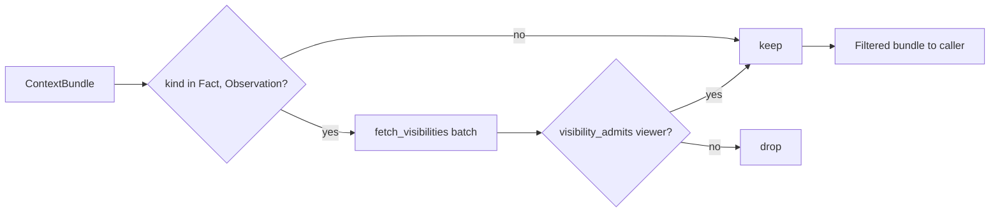

# Visibility & Access

Memory you cannot scope is memory you cannot share. A single `KnowledgeBase` often holds claims
belonging to many participants — some public, some private to one person, some scoped to a team or
organization. uniko attaches a **visibility scope** to the memory types that carry sensitive
claims, and can filter every recall against the identity of whoever is asking so nothing leaves a
query that the caller is not entitled to see.

!!! warning "Filtering is opt-in and fails open"
    The default read scope is `RecallScope::Unrestricted`, which applies **no** visibility
    filtering — recall returns everything it finds. Enforcement happens only when a viewer
    identity is bound (`RecallScope::AsAgent`, or `ViewerScope::As(..)` on `RecallConfig`).
    If you rely on visibility as an access-control boundary, you must set it explicitly;
    treat the default as "single-tenant, trusted caller".

## Why visibility matters

Recall fuses results across the whole graph. In a multi-tenant system that is a
privacy hazard: a naïve cascade would happily return a `Fact` that was only ever
meant for one participant — leaking Alice's private claim into Bob's results.
uniko gates every recall query against the asker's identity, so memory can be
shared safely in one KnowledgeBase. The mechanism has three parts:

1. **Tag** a claim with who may see it, at write time.
2. **Resolve** the asking participant's group memberships, at read time.
3. **Filter** the assembled result bundle before it reaches the caller.

Visibility is enforced for the two node types that carry free-form,
person-specific claims — `Fact` and `Observation`. Other node types have no
visibility scope and are never policy-checked.

## Visibility scopes

Visibility lives on the node's optional `visibility` property
(`DataType::String`, nullable on both the `Fact` and `Observation` labels).
A `null` or empty value means *public*. Four scope forms are recognised:

| Scope string        | Admits                                                        |
| ------------------- | ------------------------------------------------------------ |
| `null` / `""` / `"public"` | Every viewer.                                         |
| `"private:{participant_id}"` | Only the viewer whose `participant_id` matches.    |
| `"team:{team_id}"`  | Viewers who are members of `team_id`.                        |
| `"org:{org_id}"`    | Viewers who are members of `org_id` (direct or via a team).  |

!!! tip "Secure by default: unrecognized scopes deny"
    Any visibility string that doesn't match a known prefix (`private:`, `team:`, `org:`)
    admits **no one**. A typo locks a claim down — it can never accidentally widen access.

The single-string check is exposed as `visibility_admits`, re-exported from
`uniko_api::tools` (originally `uniko_memory::policy`):

```rust
use uniko_api::tools::{Viewer, visibility_admits};

let alice = Viewer::from_parts("alice", ["red".to_string()], ["acme".to_string()]);

assert!(visibility_admits(None, &alice));               // public
assert!(visibility_admits(Some("public"), &alice));     // public
assert!(visibility_admits(Some("private:alice"), &alice));
assert!(visibility_admits(Some("team:red"), &alice));   // member of red
assert!(visibility_admits(Some("org:acme"), &alice));   // member of acme
assert!(!visibility_admits(Some("private:bob"), &alice));
assert!(!visibility_admits(Some("secret:42"), &alice)); // fails closed
```

## The Viewer

A `Viewer` is the identity that recall results are filtered against. It carries
the requesting participant's id plus its resolved memberships, so that each
per-item check stays O(1):

```rust
pub struct Viewer {
    pub participant_id: String,
    pub teams: HashSet<String>,
    pub orgs: HashSet<String>,
}
```

You can build one in two ways.

=== "Resolve from the graph"

    `Viewer::new` walks the membership edges in the store once per call and
    caches the result:

    ```rust
    use uniko_api::tools::Viewer;

    let viewer = Viewer::new(&kb, "alice").await?;
    ```

    Membership is the union of:

    - direct `(:Participant)-[:MEMBER_OF]->(:Organization)` edges, and
    - teams reached via `(:Participant)-[:PART_OF_TEAM]->(:Team)`, plus the
      orgs those teams sit in via `(:Team)-[:TEAM_IN_ORG]->(:Organization)`.

    An unknown `participant_id` resolves to **empty** memberships — not an
    error. Such a viewer can still see anything `public` or
    `private:{their_id}`.

=== "Supply memberships directly"

    If you already maintain your own participant directory and want to skip the
    graph round-trip, `Viewer::from_parts` takes the memberships as-is:

    ```rust
    use uniko_api::tools::Viewer;

    let viewer = Viewer::from_parts(
        "alice",
        ["red".to_string()],   // teams
        ["acme".to_string()],  // orgs
    );
    ```

## Filtering a bundle

Recall returns a `ContextBundle` — a ranked list of `RecallItem`s. Visibility
is applied as a *filter* over that bundle, just before it is handed to the
caller, via `filter_bundle`:

```rust
use uniko_api::tools::Viewer;
use uniko_memory::policy::filter_bundle;

let viewer = Viewer::new(&kb, "alice").await?;
filter_bundle(&kb, &mut bundle, &viewer).await?;
// `bundle.items` now contains only Facts/Observations Alice may see,
// plus all non-policy node types untouched.
```

`filter_bundle` mutates the bundle in place:

1. It collects the `node_id`s of items whose `kind` is `Fact` or
   `Observation`. If there are none, it returns immediately.
2. It batch-fetches their `visibility` properties in a single store call
   (`fetch_visibilities`), keeping the filter O(items).
3. It retains each policy item only when `visibility_admits` accepts it for the
   viewer. Items with no fetched visibility are kept (treated as public).
4. It recomputes `total_tokens` using the same `items.len() * 50` heuristic the
   recall cascade uses.



!!! note "Visibility applies to claims"
    Visibility scopes the two node types that carry person-specific claims — `Fact` and
    `Observation`. Structural nodes (Messages, Chunks, Entities, Topics, Summaries, Goals,
    Tasks, Episodes) carry no scope and pass through `filter_bundle` unchanged.

!!! tip "Enforce visibility outside recall"
    `visibility_admits` is public precisely so you can gate direct lookups —
    for example, a single `Fact` fetched by id — without routing them through
    the recall cascade. Build a `Viewer` once and call `visibility_admits` per
    item.

## Where the scope is written

The `visibility` property is written by ingest and consolidation when a claim
is produced, and read back only at recall assembly time — visibility is never
queried unfiltered from outside the policy module. See
[Recall](../pipelines/recall.md) for how the `ContextBundle` is assembled before filtering,
and the [data model](data-model.md) for the full property set of the scoped
`Fact` and `Observation` node types.
