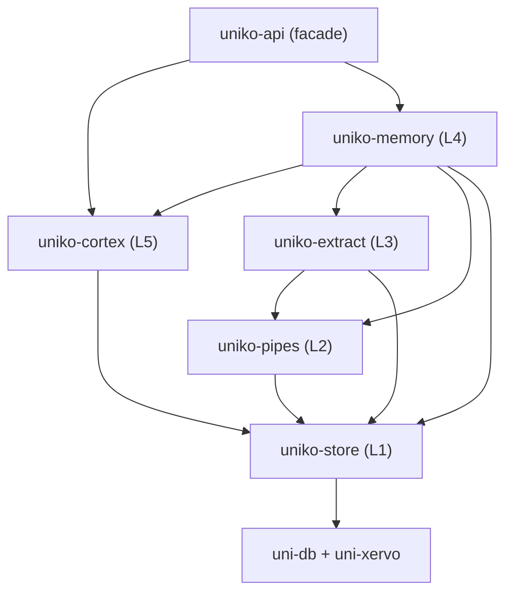

# Installation

**There is nothing to deploy.** uniko is a Rust library: you add a crate to `Cargo.toml`, build
a [`Uniko`](../reference/api.md) instance, and the entire memory system — storage, vector
and hybrid search, local NLP extraction, and the recall cascade — runs inside your process, backed
by the embedded [uni-db](https://github.com/rustic-ai/uni-db) engine and the uni-xervo model
runtime. No server, no daemon, no external vector store.

This page gives you the standard install first, then the advanced knobs — feature flags, model
selection, and GPU acceleration — that you reach for only when you need them.

!!! tip "Working in Python?"
    There's a first-class, async-first Python SDK over the same in-process engine — `import uniko`,
    no server or IPC. See the [Python SDK](../python/index.md) overview and
    [Python Quickstart](../python/quickstart.md).

## Add the dependency

uniko publishes six crates to crates.io. Depend on the `uniko-api` facade and you get the whole
stack; the lower layers are published too if you want to reach one directly.

Requires **Rust >= 1.91** (edition 2024) — the workspace's `rust-version`.

=== "crates.io"

    ```toml
    # Cargo.toml
    [dependencies]
    uniko-api = { version = "0.2.0", features = ["onnx"] }
    # ...or depend on a specific layer directly:
    uniko-memory = { version = "0.2.0", features = ["onnx"] }
    uniko-store  = "0.2.0"
    ```

=== "Git dependency"

    ```toml
    # Cargo.toml
    [dependencies]
    uniko-api = { git = "https://github.com/rustic-ai/uniko", features = ["onnx"] }
    ```

=== "Path dependency"

    ```toml
    # For working against a local checkout of the workspace.
    [dependencies]
    uniko-api = { path = "../uniko/crates/uniko-api", features = ["onnx"] }
    ```

### Build prerequisites

Building uniko compiles ONNX Runtime and a large native dependency tree from source, so a
few tools must be present before `cargo build`:

| Requirement | Why |
|---|---|
| **Rust ≥ 1.91** (edition 2024) | the workspace `rust-version` |
| **A C/C++ toolchain** | ONNX Runtime and other native crates |
| **`protoc`** (protobuf-compiler) on `PATH` | `ort` needs it at build time |
| **`mold`** — Linux only | `.cargo/config.toml` sets `-C link-arg=-fuse-ld=mold` unconditionally, so the link step fails without it |

None of this applies if you install the Python wheels — they ship prebuilt.

!!! important "`onnx` is not a default feature"
    The local NLP cascade — NER, SRL, dependency parsing — compiles only under the `onnx`
    feature, and it is **off by default** so a build that does not need local inference stays
    lean. Without it, ingest falls back to rule-based extraction. Enable it unless you know
    you want the lean build. The published Python wheels always have it on.

    (Embedding itself is served by uni-xervo's own providers, so it does not depend on this
    feature.)

### Python

Prebuilt wheels ship on PyPI for CPython 3.10+ (abi3). Install **one** of these — they all
provide the same `uniko` import and cannot coexist:

```sh
pip install uniko          # CPU (Linux x86_64/aarch64, macOS arm64, Windows x64)
pip install uniko-cuda     # NVIDIA CUDA, Linux x86_64
pip install uniko-metal    # Apple Silicon, macOS arm64
```

The GPU variants are large and may exceed PyPI's per-file limit. If an install fails for that
reason, use the project's own PEP 503 index, which serves the same artifacts from the GitHub
Release assets:

```sh
pip install uniko-cuda --extra-index-url https://rustic-ai.github.io/uniko/packages/
```

## Build a Uniko instance

The `Uniko` facade is the entry point. Everything else hangs off the handle — `memory.agent(id)`
for an agent, `agent.session(id)` for a conversation:

```rust
use uniko_memory::Uniko;

# async fn demo() -> Result<(), uniko_store::UnikoError> {
// Persistent on disk, zero-config defaults. Registers the schema
// (idempotent) and eagerly warms the embedding / NLP models.
let memory = Uniko::open("./memory.db").await?;

// Or ephemeral, e.g. for tests:
let memory = Uniko::in_memory().await?;
# Ok(())
# }
```

Reach for the builder to tune capabilities — the embedder, an LLM for `answer()`, streaming ingest,
or a fully custom config:

```rust
use uniko_memory::{EmbeddingConfig, LlmSpec, Uniko};

# async fn demo() -> Result<(), uniko_store::UnikoError> {
let memory = Uniko::builder()
    .path("./memory.db")
    .embedding(EmbeddingConfig::bge_small_en_v15())
    .llm(LlmSpec::openai("llm/default", "gpt-4o-mini", None))
    .build()
    .await?;
# Ok(())
# }
```

!!! note "The low-level engine is still there"
    `Uniko` wraps a `KnowledgeBase` (the `uniko-store` engine) plus the ingest pipeline. For embedded
    or advanced use you can drive `uniko_store::KnowledgeBase` and `uniko_memory::PipelineSystem`
    directly — see [Engine internals](../reference/api.md#engine-internals).

!!! tip "Runs fully offline"
    With `features = ["onnx"]` — BGE-small embeddings, the INT8 NLP cascade, the MiniLM reranker,
    and **no** `llm` feature — uniko runs entirely on CPU with zero external API calls. That makes
    it a fit for edge agents, air-gapped deployments, and privacy-sensitive workloads. Summary
    generation stays extractive and offline unless you opt into the `llm` feature for
    LLM-rewritten summaries.

    Without `onnx`, extraction degrades to the rule-based path rather than failing.

That is the whole standard install. The sections below are for when you want to understand the
crate layering, accelerate on a GPU, or swap models.

## The crates

uniko is organized as a layer stack where the layer numbers rank meaning, not dependency
direction. Most crates depend only on lower layers, with one deliberate exception: L4
`uniko-memory` depends on L5 `uniko-cortex`, because cortex's P5/P6 sweeps subscribe to memory's
consolidation. The graph database (`uni-db`) is sealed behind the bottom layer so higher crates
never touch it directly.

| Crate | Layer | Responsibility |
|-------|-------|----------------|
| `uniko-store` | 1 | Graph storage, search (vector / fulltext / hybrid), and the Locy runtime. Wraps uni-db. |
| `uniko-pipes` | 2 | Pipeline infrastructure — the `Step` trait, circuit breaker, retry, DLQ, metrics. |
| `uniko-extract` | 3 | Content processing — NER, observations, chunking, ingest, embedding. |
| `uniko-memory` | 4 | Memory management — pipelines, the recall cascade, rules, consolidation. |
| `uniko-cortex` | 5 | Higher reasoning — procedure promotion (P5) and topic detection (P6). |
| `uniko-api` | facade | Public facade: builders and re-exports, no logic of its own. |



!!! tip "Which crate do I add?"
    If you just want to record and recall memories, depend on `uniko-api` (or `uniko-memory`). If
    you only need the typed graph store, vector search, and Locy runtime, `uniko-store` alone is
    enough.

!!! note "Sharing one model runtime across knowledge bases"
    If you open many knowledge bases in one process, you don't want each one to load its own ONNX
    sessions. Build a shared runtime once with `KnowledgeBase::build_shared_runtime` and hand it to
    each `KnowledgeBase::open_with_runtime` call so the model weights and activation arenas stay
    resident exactly once.

## Advanced: Cargo feature flags

The defaults are tuned for a CPU-only build. The flags below turn on optional content-processing
paths and hardware acceleration.

### `uniko-extract`

```toml
[dependencies]
uniko-extract = { path = "../uniko/crates/uniko-extract", features = ["onnx"] }
```

| Feature | Default | Effect |
|---------|---------|--------|
| `code-parse` | **on** | Tree-sitter parsers (Python, Rust, JavaScript, TypeScript) for structure-aware code chunking. |
| `onnx` | off | Pulls in `ort` (ONNX Runtime), `tokenizers`, and `ndarray` for the local ONNX inference path. |
| `pdf-ocr` | off | Tiered PDF extraction via `uni-xervo-pdf` (rasterizer + OCR wiring), producing `:Page`/`:Block` document structure. Without it the PDF path is pure-Rust and text-only. |

### `uniko-memory`

| Feature | Default | Effect |
|---------|---------|--------|
| `onnx` | off | Forwards to `uniko-extract/onnx`. |
| `llm` | off | Enables the abstractive (LLM-rewritten) path for session Summary generation. When absent, summary generation stays **deterministic / extractive and fully offline**. |
| `gpu-cuda`, `gpu-metal` | off | Forward to the matching `uniko-store` feature. |
| `mistralrs`, `candle` | off | Forward to the matching `uniko-store` feature. |

### `uniko-store`

| Feature | Default | Effect |
|---------|---------|--------|
| `gpu-cuda` | off | Enables NVIDIA CUDA acceleration in uni-db. Requires the CUDA toolkit at build time. |
| `gpu-metal` | off | Enables Apple Metal / CoreML acceleration in uni-db (macOS only). |
| `mistralrs` | off | Enables uni-db's mistral.rs provider, for running a local LLM in-process. |
| `candle` | off | Enables uni-db's candle provider, the other local-LLM backend. |
| `batch-record` | off | Diagnostic-only: captures bulk-write batches in a process-global buffer so benchmarks can replay them. Never enable in production. |

### `uniko-api`

The facade forwards exactly five features: `onnx`, `gpu-cuda`, `gpu-metal`, `mistralrs`, and
`candle`. It does **not** forward `llm` or `pdf-ocr` — enable those on `uniko-memory` and
`uniko-extract` directly if you need them.

!!! warning "GPU features are build-time"
    `gpu-cuda` and `gpu-metal` are passthrough features that flip the corresponding uni-db
    features. They require the matching toolchain present when you compile (CUDA toolkit for
    `gpu-cuda`). Without them, inference runs on CPU via ONNX Runtime.

## Advanced: models used at runtime

uniko registers up to five model *aliases* in the uni-xervo catalog when a knowledge base opens —
two unconditionally (`embed/default`, `nlp/default`), three only when the matching capability is
configured. Each
resolves to a model that uni-xervo loads and runs in-process. With the default configuration the
catalog warms models lazily on first use; `open` eagerly pre-warms them so the first query doesn't
pay cold-start latency.

| Alias | Task | Default model | Notes |
|-------|------|---------------|-------|
| `embed/default` | Embedding | `BAAI/bge-small-en-v1.5` | 384-dim, BERT-based MTEB-strong retriever. Query side uses the prefix `"Represent this sentence for searching relevant passages: "`; documents go in raw. |
| `nlp/default` | NLP | `dragonscale-ai/kniv-deberta-nlp-base-en-xsmall` | Multi-task cascade loaded from the `onnx/cascade-int8.onnx` (INT8) artifact. xervo owns tokenization and POS / NER / DEP / SRL / CLS decode; uniko adapts the output. |
| `rerank/default` | Rerank | `cross-encoder/ms-marco-MiniLM-L-6-v2` | Cross-encoder reranker, **enabled by default**. 22M params; re-scores the top RRF candidates. Registered only when `reranker.enabled` and `style != "colbert"`. |
| `embed/hybrid` | Hybrid embed | same model as `embed/default` | Registered **only** when `EmbeddingConfig` sets `sparse_dimensions` or `multivector_dimensions` (e.g. the `bge-m3` preset). Backs the learned-sparse and ColBERT channels — see [Hybrid retrieval](../guides/configuration.md#sparse-colbert-hybrid-retrieval). |
| `ocr/default` | OCR | `monkt/paddleocr-onnx` | Registered **only** when `ocr.enabled` is set. Drives the OCR tier of tiered PDF extraction. |

!!! note "Where these defaults live"
    These values come from `UnikoConfig`'s defaults: `EmbeddingConfig::bge_small_en_v15()`
    (384-dim), the `NlpConfig` defaults (`kniv-deberta-nlp-base-en-xsmall` +
    `onnx/cascade-int8.onnx`), and `RerankerConfig::default()` (MS-MARCO MiniLM-L-6-v2, enabled).
    Every one is overridable on `UnikoConfig` before you call `open`.

### Embedding

Embeddings power vector search across every semantically indexed node — Message, Chunk,
Observation, Summary, Entity, Fact, and more. The default embedder is **BGE-small-en-v1.5** at 384
dimensions. Other presets ship in `EmbeddingConfig` (e.g. `bge_large_en_v15()` at 1024-dim,
`minilm_l6_v2()` at 384-dim) and are selectable by short name via `EmbeddingConfig::preset(...)`.

!!! warning "Index dimension is fixed at open"
    The vector indexes are created for the embedder's dimension. If you switch to an embedder with
    a different dimension (e.g. BGE-large at 1024-dim), open a fresh knowledge base — you cannot
    mix dimensions in one index.

### NLP

NER and observation extraction route through the `nlp/default` alias: a multi-task **kniv-deberta**
cascade running through uni-xervo's `local/onnx` provider. The default artifact is INT8-quantized
(`onnx/cascade-int8.onnx`) for CPU-feasible inference. SRL (semantic role labelling) is gated by
`UnikoConfig.nlp_srl_enabled`; the remaining tasks (POS, NER, DEP, CLS) always run. Extraction
adapts gracefully: if the runtime or alias is unavailable, a rule-based path keeps extraction
working end-to-end instead of failing.

### Reranker

The cross-encoder reranker (`rerank/default`) is enabled by default and re-scores the top recall
candidates. It is the cheapest BERT-family option in the box (MS-MARCO MiniLM-L-6-v2, 22M params);
disable it by constructing `RerankerConfig { enabled: false, ..Default::default() }`.

## System prerequisites

uniko's runtime dependencies are pulled in as crates and built with your application — there is
nothing to install separately for the default CPU build.

- **ONNX Runtime** — the local inference path (embeddings, NLP, reranker) uses `ort` (ONNX Runtime
  bindings) through uni-xervo. The default `ort` configuration downloads/links a prebuilt runtime
  at build time.
- **Model downloads** — the default embedding, NLP, and reranker models are pulled from their model
  repositories on first use (and pre-warmed on `open`). A fresh machine downloads the default
  models once, then caches the weights. Use `KnowledgeBase::open_with_xervo_no_prefetch` for
  read-only tooling that never embeds or generates, to skip the warm-up cost.
- **GPU toolchains** (optional) — only required when building with `gpu-cuda` (CUDA toolkit) or
  `gpu-metal` (macOS / CoreML).

## Next steps

<div class="feature-grid" markdown>
<div class="feature-card" markdown>
### [Quickstart](quickstart.md)
Build a `Uniko` instance and record your first memory.
</div>
<div class="feature-card" markdown>
### [Architecture](../concepts/architecture.md)
How the layered crates and the sealed uni-db boundary fit together.
</div>
</div>
