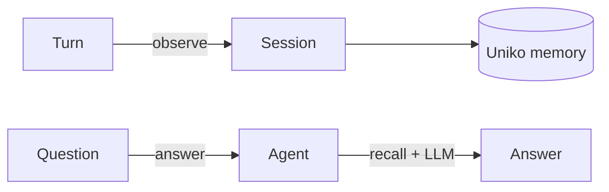

# Quick Start

In one Rust program you will take an empty database to an answered question: observe a short
conversation, then ask *"What pet does Alice have?"* and get the answer back from compiled
knowledge. The recall path never calls an LLM — the only model call here is the one that phrases the
final answer. This is the same flow the benchmark harness runs.

The path is three moves:

1. Build a [`Uniko`](../reference/api.md) instance — the single owning handle to your memory.
2. Open a `Session` and `observe` a few `Turn`s — a tiny conversation.
3. Ask `agent.answer(...)` — it recalls the relevant context and synthesizes an answer.

!!! note "uniko is a Rust library"
    There is no server to launch and no command to run. You add the crates to your
    own binary and call the methods below. Everything here is `async`; the examples
    assume a Tokio runtime.

## The shape of the thing

A `Uniko` instance owns everything — the underlying [uni-db](../concepts/architecture.md) graph, the
model runtime (embeddings, reranker, generation), and the ingest pipeline. From it you mint an
`Agent` (an identity that can be scoped), and from the agent a `Session` (a conversation thread).
Writes go through `session.observe(...)`; reads — `recall`, `answer`, `query` — go through the agent.



## What success looks like

When you run this, observing each turn extracts entities and observations and commits before
returning — so the next read sees it immediately (read-after-write). The query prints a one-line
answer — *"Alice has a rescue greyhound named Biscuit"* — the count of recalled items that grounded
it, and the sources each item traces back to.

## A complete example

```rust
use uniko_memory::{LlmSpec, Turn, Uniko};

#[tokio::main]
async fn main() -> anyhow::Result<()> {
    // 1. Build an instance. `in_memory()` is ephemeral; use `.path("./data/kb")`
    //    to persist. `.llm(...)` enables `answer()` — recall itself needs no LLM.
    let memory = Uniko::builder()
        .in_memory()
        .llm(LlmSpec::openai("llm/default", "gpt-4o-mini", None))
        .build()
        .await?;

    // 2. An agent is an identity; a session is a conversation thread.
    let agent = memory.agent("assistant");
    let mut session = agent.session("session-1");

    // 3. Observe a tiny conversation. `observe` commits before returning, so a
    //    following read sees it. Session/Participant nodes are created on first sight.
    session
        .observe(Turn::new("alice", "I just adopted a rescue greyhound named Biscuit."))
        .await?;
    session
        .observe(Turn::new("bob", "Nice! How is Biscuit settling in?"))
        .await?;
    session
        .observe(Turn::new("alice", "Great — she already sleeps on the sofa every afternoon."))
        .await?;

    // 4. Ask. `answer` runs the recall cascade, hands the ranked context to the
    //    configured LLM, and returns the answer plus the context that grounded it.
    let answer = agent.answer("What pet does Alice have?").await?;

    println!("answer: {}", answer.text);
    println!("grounded on {} items", answer.context.items.len());
    for source in answer.citations() {
        println!("  source: {source:?}");
    }

    // 5. Drain workers and close the store cleanly. Every handle that clones
    //    the store — `Session` *and* `Agent` — must be dropped first.
    drop(session);
    drop(agent);
    memory.shutdown().await?;
    Ok(())
}
```

## Step by step

### Build the instance

```rust
let memory = Uniko::builder()
    .in_memory()
    .llm(LlmSpec::openai("llm/default", "gpt-4o-mini", None))
    .build()
    .await?;
```

`Uniko::builder()` configures capabilities, then `build()` warms the models so the first query is
fast. `in_memory()` is ephemeral; swap in `.path("./data/kb")` for a durable, file-backed store —
same builder, same handle. For the zero-config defaults (the benchmark-validated stack), just
`Uniko::in_memory().await?` or `Uniko::open("./data/kb").await?`.

`.llm(...)` registers a generation model so `agent.answer(...)` can synthesize — recall and
retrieval need no LLM. `LlmSpec::openai(alias, model_id, base_url)` reads `OPENAI_API_KEY` from the
environment; there's also `LlmSpec::openai_with_key_env(...)` and `LlmSpec::mistralrs(...)` for a
local model.

!!! tip "Configuration lives on the builder"
    Embedders, NLP, and the reranker are set with `.embedding(EmbeddingConfig::...)` and friends, or
    drop in a fully-tuned `UnikoConfig` with `.raw_config(cfg)`. See
    [Configuration](../guides/configuration.md).

### Observe the conversation

```rust
let agent = memory.agent("assistant");
let mut session = agent.session("session-1");
session.observe(Turn::new("alice", "I adopted a rescue greyhound named Biscuit.")).await?;
```

`observe` runs the full ingest pipeline — chunking, entity extraction, observation extraction — and
**commits before returning**, so the next `recall`/`answer` sees the turn. The `Session` and
`Participant` are created on first sight from the ids you pass; you don't pre-register them.

A `Turn` is a builder: `Turn::new(sender, content)` plus optional `.id(...)` (idempotency),
`.at(timestamp)`, `.addressed_to(vec![...])`, `.metadata(k, v)`, and `.attach(IngestSource::...)` to
ride a document along with the message. To load a standalone document (no conversation), use
`session.ingest(IngestSource::path("handbook.md")).await?`.

!!! note "Throughput vs. read-after-write"
    `observe` is durable and synchronous. For high-volume ingest where you don't need the result
    immediately, build with `.streaming(true)` and use `session.submit(turn)` (fire-and-forget) then
    `session.flush().await?`.

### Ask a question

```rust
let answer = agent.answer("What pet does Alice have?").await?;
println!("{}", answer.text);
```

`agent.answer(...)` returns an [`Answer`](../reference/api.md): `answer.text` is the synthesized
reply, `answer.context` is the ranked recall bundle that grounded it (`items`, `coverage`,
`total_tokens`), and `answer.citations()` lists the messages/attachments the answer drew on. `answer.model`
carries the LLM *alias* you registered. Note `answer.input_tokens` and
`answer.output_tokens` are always `None` on this path — they are populated only by callers that
drive `answer_query` with their own usage accounting.

Want just the context, no LLM? Call `agent.recall("the deadline").await?` — it returns the same
`ContextBundle` for you to format into your own prompt. Each `RecallItem` carries its `kind`
(`Chunk`/`Fact`/`Observation`/…) and `sources` (the turns/documents it came from). See
[Recall & Retrieval](../guides/retrieval.md).

### Shut down

```rust
drop(session);
drop(agent);
memory.shutdown().await?;
```

`shutdown` consumes the instance and drains the workers within the configured timeout. Drop **every**
outstanding `Agent` and `Session` handle first — each holds its own clone of the store, and
`shutdown` errors if it is not the sole owner.

## Where to go next

<div class="feature-grid" markdown>
<div class="feature-card" markdown>
### [Recall & Retrieval](../guides/retrieval.md)
`recall`/`answer`, item `kind` + `sources` provenance, and dereferencing them with `agent.data()`.
</div>
<div class="feature-card" markdown>
### [Agent Tools](../guides/agent-tools.md)
Goals and tasks (`agent.goals()`), plus the episode/action/fact recording primitives.
</div>
<div class="feature-card" markdown>
### [Concepts](../concepts/architecture.md)
The layered architecture, the node types (Message, Observation, Fact, Entity, Episode, …), and how
memory is organized.
</div>
</div>
