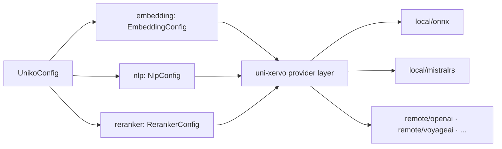

# Configuration

Configuration is a Rust value, not a config server. Because uniko runs
entirely in-process, every model, threshold, and pipeline cadence is a field
on one struct — `UnikoConfig`, in `uniko-store` — that you set before the
[`KnowledgeBase`](../concepts/architecture.md) opens. Start from
`UnikoConfig::default()`, override what you care about, and call `validate()`
to catch constraint violations before they reach the database.

```rust
use uniko_store::config::{UnikoConfig, EmbeddingConfig};

let mut config = UnikoConfig::default();
config.embedding = EmbeddingConfig::nomic_v15(); // swap the embedder
config.recall_limit = 20;                        // widen the recall bundle
config.validate()?;                              // fail fast on bad combos
```

!!! note
    `UnikoConfig` derives `Serialize` / `Deserialize`, and the struct
    carries `#[serde(default)]`. An empty JSON object (`{}`) deserialises
    to exactly `UnikoConfig::default()`, and any field you omit falls
    back to its spec default. This is what lets the benchmark harness
    layer a JSON profile on top of the defaults without re-stating every
    knob.

---

## Swappable models

uniko's NLP, embedding, and reranking models all resolve through the
**uni-xervo** provider layer. A model is named by a provider id (e.g.
`local/onnx`, `local/mistralrs`, `remote/openai`) plus a model id; xervo
loads and warms it. Because the model selection is data, not code, you
swap a model by editing config fields — no recompile of the pipeline.



### The embedder

The embedder controls auto-embedding (Message, Chunk, Observation,
Summary) and the computed embeddings on Entity, Fact, Topic, Session,
and the rest of the graph. The default is **BGE-small-en-v1.5** at 384
dimensions, served by the bundled `local/onnx` provider.

`EmbeddingConfig` ships several presets as constructor functions, plus a
`preset(name)` lookup for string-keyed selection:

=== "Default (BGE-small)"

    ```rust
    use uniko_store::config::EmbeddingConfig;

    // 384d, BERT-based, query-side prefix only — the default.
    let embed = EmbeddingConfig::bge_small_en_v15();
    ```

=== "Nomic v1.5 (768d)"

    ```rust
    // 768d, 8192 context. Adds search_document:/search_query: prefixes.
    let embed = EmbeddingConfig::nomic_v15();
    ```

=== "By name"

    ```rust
    // Returns None for an unknown name — callers print the canonical list.
    let embed = EmbeddingConfig::preset("bge-large")
        .expect("known preset");
    ```

The presets and their key properties, all defined in
`uniko-store::config`:

| Preset name        | Constructor                       | `model_id`                              | Dims | Notes |
|--------------------|-----------------------------------|-----------------------------------------|------|-------|
| `bge-small`        | `bge_small_en_v15()`              | `BGESmallENV15`                         | 384  | Default. Query-side prefix only. |
| `bge-large`        | `bge_large_en_v15()`              | `BGELargeENV15`                         | 1024 | Top-tier MTEB quality; ~10× the params of BGE-small, expect 2–3× slower per-query embedding. |
| `nomic`            | `nomic_v15()`                     | `NomicEmbedTextV15`                     | 768  | 8192 context; needs `search_document:`/`search_query:` prefixes. |
| `nomic-q` / `nomic-quantized` | `nomic_v15_quantized()` | `NomicEmbedTextV15Q`                    | 768  | Quantized — faster, lower memory. |
| `minilm`           | `minilm_l6_v2()`                  | `AllMiniLML6V2`                         | 384  | Legacy default for existing databases; no task prefixes. |
| `embeddinggemma` / `gemma` | `embedding_gemma_300m()`  | `onnx-community/embeddinggemma-300m-ONNX` | 768  | 300M-param Gemma-3 retrieval embedder via the `local/onnx` HF-Hub fallback. |
| `embeddinggemma-mistralrs` / `gemma-mistralrs` | `embedding_gemma_300m_mistralrs()` | `google/embeddinggemma-300m` | 768  | Same weights via `local/mistralrs` (candle) on GPU. |
| `bge-m3`           | `bge_m3()`                        | `aapot/bge-m3-onnx`                     | 1024 | **Hybrid**: also emits a 250,002-dim learned-sparse vector and a 1024-dim ColBERT multi-vector. See [Sparse + ColBERT hybrid retrieval](#sparse-colbert-hybrid-retrieval). |

!!! warning
    The embedding dimension is part of the on-disk vector index. The
    `dimensions` field must match the model's true output, and you
    cannot change the embedder under an existing database without
    re-indexing — the index was built at the original dimension. Pick
    the embedder up front. `validate()` rejects a zero `dimensions` or
    `batch_size`, but it cannot detect a model/dimension mismatch.

Each preset also sets the right task prefixes. Nomic uses
`document_prefix = "search_document: "` and
`query_prefix = "search_query: "`; BGE uses a query-only prefix
(`"Represent this sentence for searching relevant passages: "`); MiniLM
uses none. These are baked into the preset because the retriever was
trained on those literal strings.

By default the embedder resolves through `local/onnx`. To route
embeddings to an OpenAI-compatible endpoint instead, set the `provider`
to `"remote/openai"` and pass `provider_options` (this is where a
`base_url` lands):

```rust
let mut embed = EmbeddingConfig::bge_small_en_v15();
embed.provider = "remote/openai".into();
embed.provider_options = Some(serde_json::json!({
    "base_url": "http://litellm-cloud:4000/v1"
}));
```

### The NLP cascade

NER and observation extraction run through a single ONNX cascade model,
**kniv-deberta**. `NlpConfig` exposes the model id, the ONNX artifact to
load, and a batch size:

```rust
use uniko_store::config::NlpConfig;

let nlp = NlpConfig::default();
// model_id:        "dragonscale-ai/kniv-deberta-nlp-base-en-xsmall"
// artifact:        "onnx/cascade-int8.onnx"
// max_batch_size:  16
```

| Field                | Default | Meaning |
|----------------------|---------|---------|
| `model_id`           | `dragonscale-ai/kniv-deberta-nlp-base-en-xsmall` | HuggingFace id of the cascade model. |
| `artifact`           | `onnx/cascade-int8.onnx` | Which ONNX export under `model_id/` to load (e.g. INT8 vs FP32). |
| `max_batch_size`     | `16`    | Maximum batch size for the ONNX session. |
| `execution_providers`| `None`  | EP override; `None` picks a feature-aware default (CUDA+CPU on `gpu-cuda`, CoreML+CPU on `gpu-metal`, CPU otherwise). |

Swapping the cascade variant (xsmall ↔ small, INT8 ↔ FP32) is a config
edit — change `model_id` or `artifact` and the loader picks it up.

The cascade's SRL (semantic-role-labelling) head is gated separately on
the main config:

```rust
config.nlp_srl_enabled = true; // default: true
```

When `true`, the pipeline computes SRL frames (one extra ONNX forward
per VERB per sentence) and downstream extraction uses them. Set it to
`false` if profiling shows the per-verb re-forward cost is unacceptable
for a workload; `NlpResult.srl_frames` then stays empty and extraction
behaves as before.

### The reranker

After hybrid recall fuses candidates with reciprocal rank fusion, an
optional cross-encoder re-scores the top `top_n` items. The reranker is
**enabled by default** with `cross-encoder/ms-marco-MiniLM-L-6-v2`:

```rust
use uniko_store::config::RerankerConfig;

let rr = RerankerConfig::default();
// enabled:       true
// model_id:      "cross-encoder/ms-marco-MiniLM-L-6-v2"
// top_n:         50
// apply_sigmoid: true
// style:         "cross-encoder"
```

| Field                | Default | Meaning |
|----------------------|---------|---------|
| `enabled`            | `true`  | Register and invoke the reranker. |
| `model_id`           | `cross-encoder/ms-marco-MiniLM-L-6-v2` | Cross-encoder ONNX export. |
| `top_n`              | `50`    | Number of top RRF candidates re-scored. Must be `>= recall_limit` when enabled. |
| `apply_sigmoid`      | `true`  | Map raw logits to `[0, 1]` via sigmoid. |
| `style`              | `cross-encoder` | `"cross-encoder"` for BERT-family encoders; `"generative"` for decoder-LM rerankers (e.g. Qwen3-Reranker); `"colbert"` for in-process ColBERT MaxSim (no reranker model — requires `multivector_dimensions`). |
| `execution_providers`| `None`  | EP override, same semantics as the embedder. |

`RerankerConfig` ships two presets:
`RerankerConfig::minilm_l6()` (22M params, the default model) and
`RerankerConfig::bge_base()` (`BAAI/bge-reranker-base`, 278M params,
more accurate, CPU-feasible). Both construct with `enabled: false`; the
`Default` impl flips MiniLM on.

!!! tip
    MiniLM is 12× faster than BGE-reranker-base, so default-on rerank is
    cheap relative to the rest of recall. To turn it off entirely:

    ```rust
    config.reranker = RerankerConfig { enabled: false, ..Default::default() };
    ```

!!! warning
    When the reranker is enabled, `validate()` requires
    `reranker.top_n >= recall_limit`. If you raise `recall_limit` above
    `top_n` (default 50), bump `top_n` to match or validation fails —
    otherwise truncation would discard items the reranker never saw.

---

## Tunable thresholds

`UnikoConfig` exposes the numeric knobs that govern the recall cascade,
hybrid fusion, consolidation, and memory decay. All defaults below are
from `UnikoConfig::default()`.

### Recall and fusion

| Field                       | Default | Meaning |
|-----------------------------|---------|---------|
| `recall_limit`              | `15`    | Maximum items returned from recall. |
| `recall_token_budget`       | `8192`  | Maximum total tokens in the context bundle. |
| `recall_min_score`          | `0.001` | Minimum fused score for inclusion. |
| `recall_vector_weight`      | `0.5`   | Vector-similarity weight in hybrid fusion `[0.0–1.0]`. |
| `recall_bm25_weight`        | `0.5`   | BM25 fulltext weight in hybrid fusion `[0.0–1.0]`. |
| `rrf_k`                     | `60.0`  | `k` constant for reciprocal rank fusion across query variants; higher flattens top-rank weighting. |
| `recall_per_variant_limit`  | `None`  | LIMIT applied to each per-variant Cypher query; `None` falls back to `recall_limit`. |
| `query_variants`            | `[]`    | Multi-query reformulation labels. Empty (the default) selects the **single** `keywords` variant. Pass all four — `keywords`, `original`, `declarative`, `type_anchored` — to opt into multi-query. |

### Cascade phase gates

The recall cascade runs in phases and exits early once a phase covers
the query. Coverage gates and the Phase 1 strategy live here:

| Field                          | Default   | Meaning |
|--------------------------------|-----------|---------|
| `phase2_coverage_threshold`    | `0.65`    | Coverage threshold for Phase 2 (Expand) early exit. |
| `phase1_strategy`              | `"boost"` | Phase 1 contribution strategy: `merge`, `boost`, or `off`. |
| `phase1_boost_alpha`           | `0.6`     | Multiplicative weight for Fact scores in the session-chunk boost under `phase1_strategy = "boost"`. |

!!! important "`boost` needs finalized sessions"
    The `boost` strategy scores **session-level chunks**, which are built by
    `Session::finalize()` (and, best-effort, by `Session::summarize()`). A
    session that is never finalized has no such chunks, so Phase 1 contributes
    nothing under the default strategy. Call `finalize()` at the end of a
    conversation, or use `Agent::finalize_session` / `unfinalized_session_ids`
    to backfill an existing knowledge base.
| `phase2_mmr_lambda`            | `0.7`     | MMR relevance-vs-diversity for Phase 2 dedup (`1.0` = pure relevance, `0.0` = pure diversity). |
| `phase2_mmr_duplicate_threshold` | `0.85`  | Token-overlap threshold above which a Phase 2 candidate is dropped as a hard duplicate. |
| `phase2_temporal_enabled`      | `true`    | Temporal-interval channel; fires only when the query has a parsed temporal phrase. |
| `phase2_graph_enabled`         | `true`    | Graph spreading-activation channel; fires only when the query has a resolvable entity seed. |
| `phase2_graph_damping`         | `0.85`    | PPR damping factor for the graph channel. |
| `phase2_graph_max_iter`        | `30`      | PPR power-iteration cap for the graph channel. |
| `phase2_graph_edge_weights`    | `{}`      | Per-edge-type weight multipliers for graph propagation; empty map uses the built-in `default_phase2_graph_edge_weights`. |

!!! note
    `phase2_coverage_threshold` must be
    in `(0.0, 1.0]`; `validate()` rejects values outside that range. The
    `phase1_strategy` is stored as a string (not an enum) so configs
    deserialised across feature flags stay compatible.

### Entity admission

Strict admission keeps NER noise out of the `:Entity` graph at ingest time —
temporal, measurement, and quoted-string spans (already captured as
observations) and greeting/discourse fragments mis-tagged as people are
dropped, and the low-confidence catch-all is gated:

| Field                          | Default | Meaning |
|--------------------------------|---------|---------|
| `entity_strict_admission`      | `true`  | Drop NER noise and greeting fragments. Set `false` to restore legacy admit-everything behavior (for A/B comparison). |
| `entity_other_min_confidence`  | `0.9`   | Minimum confidence for an `Other` catch-all span (Event/Product/WorkOfArt/Group/Misc) to be admitted when strict admission is on. |

### Consolidation

Consolidation (P4) collapses near-duplicate Facts and refreshes their
embeddings:

| Field                                   | Default | Meaning |
|-----------------------------------------|---------|---------|
| `consolidation_threshold`               | `20`    | Number of observations that trigger consolidation. |
| `consolidation_interval_secs`           | `900`   | Seconds between periodic consolidation runs. |
| `consolidation_cluster_objects`         | `true`  | Cosine-cluster object surface forms before mode-voting picks the canonical (vs legacy exact-string buckets). |
| `consolidation_date_augment_embedding`  | `true`  | Prepend a month-year prefix (from the Fact's `first_observed`) to the embedded Fact text so temporally-near Facts co-locate. |

### Memory decay

Importance decays exponentially and low-importance nodes are pruned:

```rust
config.half_life_days = 30.0; // importance * exp(-ln(2)/half_life * age_days)
config.prune_below   = 0.05;  // prune nodes below this importance
```

| Field            | Default | Meaning |
|------------------|---------|---------|
| `half_life_days` | `30.0`  | Half-life (days) for importance decay. Must be positive. |
| `prune_below`    | `0.05`  | Importance threshold below which nodes are pruned. Must be in `[0.0, 1.0)`. |

### Chunking and sessions

The chunking thresholds match the ingest pipeline's content router:

| Field                              | Default | Meaning |
|------------------------------------|---------|---------|
| `message_chunk_threshold`          | `1024`  | Token count above which a Message is chunked (below this it embeds directly). |
| `action_output_artifact_threshold` | `256`   | Token count above which an Action output overflows to an Artifact. |
| `max_chunk_tokens`                 | `256`   | Maximum tokens per chunk. |
| `min_chunk_tokens`                 | `32`    | Minimum tokens per chunk (fragments below this merge). |
| `chunk_overlap_tokens`             | `0`     | Overlap tokens between adjacent chunks; `0` = auto (10% of max, capped at 50). |
| `session_inactivity_secs`          | `3600`  | Inactivity window after which an open Session auto-closes and is summarised; `0` disables. |

!!! note
    `validate()` requires `min_chunk_tokens < max_chunk_tokens`. The
    design rationale and per-content-type chunking strategies (recursive
    splitting, tree-sitter AST, DOM sections, etc.) are described in the
    ingest pipeline; these fields are the runtime levers over that
    machinery.

### Vector index

The index algorithm and distance metric are set once at database
creation:

```rust
use uniko_store::config::{VectorAlgorithm, VectorMetricChoice};

config.vector_algorithm = VectorAlgorithm::HnswSq { m: 16, ef_construction: 100 };
config.vector_metric    = VectorMetricChoice::Cosine;
```

The default is `HnswSq { m: 16, ef_construction: 100 }` with `Cosine`
distance. Other variants cover `HnswFlat`, `HnswPq`, `IvfSq`, `IvfPq`,
and `IvfRq` for different scale / recall / memory trade-offs.

### Pipelines, retries, and circuit breaker

| Field                         | Default  | Meaning |
|-------------------------------|----------|---------|
| `ingest_queue_capacity`       | `200`    | Bounded channel capacity for the ingest worker. |
| `consolidation_queue_capacity`| `32`     | Bounded channel capacity for the consolidation worker. |
| `retry_max_attempts`          | `3`      | Maximum retry attempts for retryable operations. |
| `retry_initial_delay_ms`      | `500`    | Initial backoff delay (exponential base). |
| `retry_max_delay_ms`          | `30000`  | Backoff cap. |
| `circuit_failure_threshold`   | `5`      | Consecutive failures before the circuit breaker opens. |
| `circuit_recovery_ms`         | `60000`  | Milliseconds the breaker stays open before probing. |

`validate()` requires `retry_initial_delay_ms <= retry_max_delay_ms`.

### Blob storage and external files

| Field                     | Default        | Meaning |
|---------------------------|----------------|---------|
| `blob_storage`            | `BlobStorage::Lance` | Backend for `:ArtifactContent` bytes; persisted on first open. Reopening with a different variant is a hard error (no implicit migration). |
| `catalog_path`            | `None`         | Override the built-in xervo model catalog with a JSON file. |
| `schema_path`             | `None`         | Load the schema from a JSON file instead of registering it programmatically. |
| `observation_rules_path`  | `None`         | Load observation-extraction patterns from a YAML file instead of the bundled `english.yml`. |

!!! warning "`schema_path` and the tracked snapshot"
    `config/schema.json` in the repo is a **snapshot** produced by
    `cargo run --bin export-schema`. Pointing `schema_path` at a snapshot
    replaces the programmatic schema entirely, so a stale file silently
    yields a graph missing whatever labels and edges were added since it was
    generated. Regenerate it after any schema change, or leave `schema_path`
    as `None` and let `register_schema` run.

---

## Sparse + ColBERT hybrid retrieval

By default recall fuses dense vector search with BM25. A *hybrid* embedder
adds two more channels: a **learned-sparse** vector (a term-weight
distribution over the model vocabulary, better than BM25 at exact-term
matching) and a **ColBERT multi-vector** (one vector per token, scored by
late-interaction MaxSim). Both are off unless you choose a hybrid embedder.

The `bge-m3` preset is the supported one:

```rust
use uniko_store::config::{EmbeddingConfig, RerankerConfig};

let mut config = UnikoConfig::default();
config.embedding = EmbeddingConfig::bge_m3();  // 1024-dim dense
                                               // + 250,002-dim sparse
                                               // + 1024-dim ColBERT
config.recall_sparse_enabled = true;           // turn on the sparse channel
config.reranker = RerankerConfig {
    enabled: true,
    style: "colbert".to_string(),              // MaxSim instead of a cross-encoder
    ..Default::default()
};
```

| Field | Default | Meaning |
|-------|---------|---------|
| `embedding.sparse_dimensions` | `None` | `Some(n)` adds a `SPARSE_VECTOR(n)` column on `:Chunk` and `:Observation`. |
| `embedding.multivector_dimensions` | `None` | `Some(d)` adds a `List(Vector(d))` ColBERT column on the same labels. |
| `recall_sparse_enabled` | `false` | Fan out an extra `uni.sparse.query` channel per variant, joining the existing RRF fusion. |
| `reranker.style` | `cross-encoder` | Set to `"colbert"` to re-score the top `top_n` candidates by MaxSim instead of loading a reranker model. |

Three `validate()` gates catch the invalid combinations at open time:

- `recall_sparse_enabled` without `sparse_dimensions` is an error.
- `reranker.style = "colbert"` without `multivector_dimensions` is an error.
- `reranker.top_n` must be `>= recall_limit` whenever the reranker is enabled.

!!! note "Cost"
    Setting either hybrid dimension registers a second model alias,
    `embed/hybrid`, alongside `embed/default`. The runtime caches by task, so
    **the model loads twice** — budget roughly 2× embedder memory. The ColBERT
    index uses an exact (flat) vector index because it only ever re-scores a
    candidate window, never scans.

    Neither channel is reachable from the Python builder today; configure them
    from Rust.

---

## OCR for scanned PDFs

`UnikoConfig::ocr` configures the OCR model behind *tiered* PDF extraction —
the path that produces `:Page` / `:Block` document structure rather than a
flat text dump.

| Field | Default | Meaning |
|-------|---------|---------|
| `enabled` | `false` | Register the `ocr/default` alias and take the tiered PDF path. |
| `model_id` | `monkt/paddleocr-onnx` | HF repo holding the detection + recognition ONNX exports (English PP-OCRv5, Apache-2.0). |
| `rec_artifact` | `languages/english/rec.onnx` | CRNN/CTC recognizer path within the repo. |
| `char_dict_path` | `languages/english/dict.txt` | Character dictionary, one token per line. |
| `det_artifact` | `detection/v5/det.onnx` | DBNet detector; enables detect → crop → recognize with real bounding boxes. |
| `image_height` | `48` | Recognizer input height, pixels. |
| `image_width` | `320` | Recognizer input width, pixels. |
| `normalization` | `siglip` | `"imagenet"` or `"siglip"`; the PP-OCRv5 export expects `siglip`. |
| `execution_providers` | `None` | ONNX execution providers; `None` is the feature-aware default. |

!!! warning "Not reachable through the facade today"
    Tiered PDF extraction needs **all three** of: the `pdf-ocr` Cargo feature,
    `ocr.enabled = true`, and a live model runtime. `pdf-ocr` is declared only
    on `uniko-extract` and is **not forwarded** by `uniko-memory`, `uniko-api`,
    or the Python wheels — so setting `ocr.enabled` alone changes nothing
    unless you depend on `uniko-extract` directly and enable the feature there.
    Without the tiered path, PDFs still ingest via the pure-Rust, text-only
    extractor.

---

## Cargo feature flags

A few capabilities are gated behind Cargo features so a CPU-only or
offline build stays lean. Enable them per crate.

| Crate            | Feature       | Default | Effect |
|------------------|---------------|---------|--------|
| `uniko-store`    | `gpu-cuda`    | off     | Enable NVIDIA CUDA acceleration in uni-db (requires the CUDA toolkit at build time). |
| `uniko-store`    | `gpu-metal`   | off     | Enable Apple Metal/CoreML acceleration in uni-db (macOS only). |
| `uniko-extract`  | `code-parse`  | **on**  | tree-sitter AST chunking for Python, Rust, JavaScript, TypeScript. |
| `uniko-extract`  | `onnx`        | off     | ONNX runtime (`ort` + `tokenizers` + `ndarray`) for the embedder / NLP cascade adapter. |
| `uniko-memory`   | `onnx`        | off     | Pass-through that enables `uniko-extract/onnx`. |
| `uniko-memory`   | `llm`         | off     | Adds an LLM-rewritten abstractive path for F59 Summaries. By default, summaries are deterministic, extractive, and fully offline. |
| `uniko-cortex`   | `llm`         | off     | Backs `uniko-memory/llm`. |
| `uniko-extract`  | `pdf-ocr`     | off     | Tiered PDF/OCR extraction via `uni-xervo-pdf`. Not forwarded by any higher crate — see [OCR](#ocr-for-scanned-pdfs). |
| `uniko-store`    | `mistralrs`   | off     | uni-db's mistral.rs provider, for running a local LLM in-process. |
| `uniko-store`    | `candle`      | off     | uni-db's candle provider, the other local-LLM backend. |
| `uniko-store`    | `batch-record`| off     | Diagnostic only: captures bulk-write batches for benchmark replay. Never enable in production. |

`uniko-api` forwards exactly five features — `onnx`, `gpu-cuda`, `gpu-metal`,
`mistralrs`, `candle`. It does **not** forward `llm` or `pdf-ocr`; enable those
on `uniko-memory` / `uniko-extract` directly.

!!! tip
    The `execution_providers` field on `EmbeddingConfig`, `NlpConfig`,
    and `RerankerConfig` is feature-aware: with `None`, a build compiled
    with `gpu-cuda` defaults to CUDA→CPU, `gpu-metal` to CoreML→CPU, and
    a plain build to CPU. You only set `execution_providers` explicitly
    to override that default.

---

## See also

- [Architecture](../concepts/architecture.md) — how the layers and the
  `KnowledgeBase` fit together.
- [Recall](../pipelines/recall.md) — what the cascade phases and fusion
  weights actually do.
