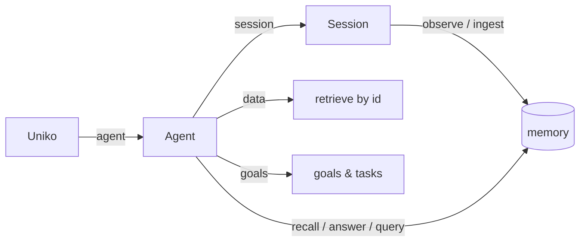

# Working with the Facade

The `Uniko` facade is the single public entry point to the memory system. This guide is the full
tour — from building an instance to every operation you'll reach for — with the idioms and the mental
model that tie them together. The [Quick Start](../getting-started/quickstart.md) is the 15-minute
taste; this is the map.

## The mental model

You program against **intentions**, not mechanisms. The facade hides the engine (`KnowledgeBase`, the
ingest pipeline, the query engine) behind a small set of verbs: *observe*, *recall*, *answer*,
*forget*. Everything hangs off one owning handle.



| Layer | What it is | You get it from |
|---|---|---|
| **`Uniko`** | the instance — owns the store, models, pipeline | `Uniko::open` / `builder()` |
| **`Agent`** | an identity that reads/writes, scopable | `memory.agent(id)` |
| **`Session`** | a conversation thread | `agent.session(id)` |

The rule of thumb: **write** through a `Session` (`observe` / `ingest`), **read** through the `Agent`
(`recall` / `answer` / `query`), **retrieve by id** through `agent.data()`, **plan** through
`agent.goals()`.

---

## 1. Build an instance

The zero-config constructors use the benchmark-validated defaults:

```rust
use uniko_memory::Uniko;

let memory = Uniko::in_memory().await?;        // ephemeral (tests, scratch)
let memory = Uniko::open("./agent-memory").await?;  // persistent, file-backed
```

Reach for the builder to turn on capabilities:

```rust
use uniko_memory::{EmbeddingConfig, LlmSpec, Uniko};

let memory = Uniko::builder()
    .path("./agent-memory")
    .embedding(EmbeddingConfig::bge_small_en_v15())          // swap the embedder
    .llm(LlmSpec::openai("answerer", "gpt-4o-mini", None))   // enables answer()
    .streaming(true)                                         // enables submit()/flush()
    .scope_to_agent()                                        // reads default to the agent's visibility
    .build()
    .await?;
```

| Builder method | Effect |
|---|---|
| `.path(p)` / `.in_memory()` | Where the store lives. |
| `.embedding(EmbeddingConfig)` | The embedder (vector search). |
| `.llm(LlmSpec)` | A generation model — **required for `answer()`**. |
| `.streaming(bool)` | Enables the fire-and-forget `submit`/`flush` lane. |
| `.scope_to_agent()` / `.scope(RecallScope)` | Default read visibility. |
| `.extractor(Arc<dyn ModalityExtractor>)` | A pluggable image/audio/video extractor — implement `modality()` and `extract()` on `uniko_extract::ingest::modality::ModalityExtractor` (`Send + Sync + Debug`). Without one, image/audio/video sources return `UnikoError::Unsupported`. |
| `.raw_config(UnikoConfig)` | Drop in a fully-tuned config (see [Configuration](configuration.md)). |

**`LlmSpec`** picks the generation model: `openai(alias, model, base_url)` (reads `OPENAI_API_KEY`),
`openai_with_key_env(...)` for a custom key var, or `mistralrs(alias, model)` for a local model.

!!! note "Capabilities, not wiring"
    You never construct a `KnowledgeBase`, a pipeline, or a model catalog. The builder is the only
    place you make capability choices; everything you don't set runs the defaults.

---

## 2. Agents and sessions

```rust
let agent = memory.agent("assistant");      // an identity; cheap to mint
let mut session = agent.session("chat-42"); // a conversation thread
```

One instance can mint many agents (`alice`, `bob`); each can be scoped to what *it* may see. A session
groups turns and lets attachments attach to the right message.

---

## 3. Write memory

### Conversation — `observe`

`observe` is the first-class write: it runs the full ingest pipeline (chunking, entity + observation
extraction) and **commits before returning**, so the next read sees it.

```rust
use uniko_memory::{IngestSource, Turn};

let result = session
    .observe(
        Turn::new("alice", "here's the spec we discussed")
            .addressed_to(vec!["assistant".into()])
            .attach(IngestSource::path("spec.pdf")),   // a document rides the turn
    )
    .await?;
// result.message       -> the ingested message
// result.attachments   -> each attachment, linked to this turn (provenance)
```

A `Turn` is a builder: `Turn::new(sender, content)` plus `.id(...)` (idempotency), `.at(timestamp)`,
`.addressed_to(...)`, `.metadata(k, v)`, `.attach(IngestSource)`, `.attachments(iter)`.

!!! note "`sender_role` is a reserved metadata key"
    `.metadata(...)` is free-form with one exception: `metadata["sender_role"]` is the only way
    to set the `role` property on the `SENT_BY` edge, which is what makes role-scoped queries
    ("what did the assistant say?") work. Set it with
    `.metadata("sender_role", json!("assistant"))`.

!!! tip "Attachments carry provenance"
    A document shared with `.attach(...)` is linked to the exact message and speaker that shared it —
    so later a recalled fact can cite *"per spec.pdf, shared by alice."* See
    [Recall & Retrieval](retrieval.md).

### Standalone documents — `ingest`

To load a corpus with no conversation, use one blob verb and one blob type:

```rust
session.ingest(IngestSource::path("handbook.md")).await?;             // MIME sniffed
session.ingest(IngestSource::bytes(pdf).with_mime(Mime::parse("application/pdf")?)).await?;
```

`IngestSource::{text, bytes, path}` builds the blob; `.with_mime(...)`, `.with_id(...)`,
`.with_path(...)` override routing. `IngestSource.metadata` is a public map with one reserved
key of its own: `metadata["content_type"]` overrides the content type recorded on the
resulting `:Artifact` (useful when, say, fetched bytes should be recorded as the source URL's
type rather than the sniffed one). `.with_mime(...)` takes a `Mime` (re-exported from
`uniko_memory`); build one with `Mime::parse("application/pdf")?` or `"application/pdf".parse()?`. The
returned `IngestOutcome` tells you what it became (`Artifact` / `Pdf`) and carries the `artifact_id`
for later retrieval. An unsupported modality surfaces as a `UnikoError::Unsupported` error, not an
`IngestOutcome` variant.

### High throughput — streaming

When you don't need read-after-write, the streaming lane (built with `.streaming(true)`) trades
immediacy for throughput:

```rust
session.submit(Turn::new("alice", "...")).await?;       // fire-and-forget
session.submit_source(IngestSource::text("notes")).await?;
session.flush().await?;                                  // barrier: drain the pipeline
```

### End of conversation — `finalize`

Whichever write lane you used, call `finalize()` when a conversation wraps up:

```rust
let report = session.finalize().await?;
```

It chunks the whole transcript and aggregates the session's observations into dense chunks wired
`ABOUT` the entities and participants involved. Those are the surfaces that session-scoped recall
and the Phase 1 session boost retrieve — without them a session contributes only its per-turn
chunks, and the default `phase1_strategy = "boost"` has nothing to score.

It is cheap and idempotent when the session has not grown (nothing is rewritten, nothing is
re-embedded), so calling it periodically during a long conversation is fine. `summarize()` calls it
for you on a best-effort basis, and `finalize()` flushes the streaming pipeline first.

`finalize()` also stamps the Session's `ended_at` with its latest message time. Note a
Session counts as *open* while `ended_at` is null, so finalizing takes it out of the
inactivity auto-close sweep; finalizing again after more turns re-stamps it.

To backfill a knowledge base ingested before this existed:

```rust
for sid in agent.unfinalized_session_ids().await? {
    agent.finalize_session(&sid).await?;
}
```

### Compile knowledge — `consolidate`

`observe` extracts Entities and Observations. Turning those into `Fact`s — voting on the
canonical claim, stamping bitemporal validity, retiring contradicted beliefs — is
consolidation:

```rust
let stats = agent.consolidate().await?;
println!("{} observations -> {} facts", stats.observations_processed, stats.facts_created);
```

It runs on the calling task and needs no streaming pipeline. An instance built with
`.streaming(true)` also consolidates on its own, on a 20-observation threshold or a 15-minute
timer, and runs the cortex sweep (procedure promotion, topic detection) afterwards.

---

## 4. Read memory — three altitudes

The same memory reads at whichever altitude the task needs:

```rust
// (a) ranked context, ready to drop into a prompt
let bundle = agent.recall("what's the deadline?").await?;        // ContextBundle

// (b) a finished answer (recall + the configured LLM)
let answer = agent.answer("when is the deadline?").await?;       // Answer

// (c) exact rows you specify (read-only Cypher)
let rows = agent.query("MATCH (m:Message) RETURN m.content AS c").await?;
```

- **`recall`** does the retrieval cascade and hands back ranked, deduped, budget-trimmed context.
- **`answer`** adds the LLM call and returns generated text plus the grounding (needs `.llm(...)`).
- **`query`** is exact and deterministic — you write the graph pattern, you get raw `Record`s.

### Scoping

Every read has an `_in` twin that confines it to a session, participant, or time window:

```rust
use chrono::{Duration, Utc};
use uniko_memory::Scope;

let scope = Scope::default()
    .sessions(["chat-42"])
    .since(Utc::now() - Duration::days(7));

let bundle = agent.recall_in("deadline", scope.clone()).await?;
let rows   = agent.query_in("MATCH (n:Message) WHERE id(n) IN $allow RETURN n", &scope).await?;
```

`recall_in`/`answer_in` apply the scope (and viewer visibility) for you; `query_in` binds the in-scope
node-ids as `$allow` for your Cypher. Full treatment in [Recall & Retrieval](retrieval.md).

---

## 5. Provenance and retrieval

Every recalled item answers **what** it is and **where** it came from:

```rust
for item in &bundle.items {
    println!("[{:?}{}] {}",
        item.kind,                                       // Chunk / Fact / Observation / …
        if item.kind.is_derived() { " derived" } else { "" },
        item.content);
    for src in &item.sources { /* Message | Attachment | Document — the lineage */ }
}
```

`agent.answer(...)` carries the same lineage, so answers are citable for free:

```rust
let ans = agent.answer("when is the deadline?").await?;
println!("{}", ans.text);
for src in ans.citations() { /* what the answer was grounded in */ }
```

And `agent.data()` dereferences those source ids into content — recall is the index lookup, `data` is
the document fetch:

```rust
let view  = agent.data().artifact("spec.pdf").await?;        // metadata + reassembled text
let bytes = agent.data().artifact_bytes("spec.pdf").await?;  // the original blob
let msg   = agent.data().message("m-12").await?;             // sender / session / attachments
```

This closes the loop with `observe`: the `artifact_id` it returned is the id you fetch by.

---

## 6. Goals and tasks

`agent.goals()` is the goal/task lifecycle surface — what the agent is pursuing, did, and plans to do:

```rust
use uniko_memory::CreateGoalParams;

let goal = agent.goals().create(CreateGoalParams {
    goal_id: Some("g-release".into()),
    title: "Ship the release".into(),
    ..Default::default()
}).await?;

agent.goals().start("g-release").await?;
agent.goals().complete("g-release", Some(serde_json::json!({ "shipped": true }))).await?;

let active    = agent.goals().active().await?;       // current work
let planned   = agent.goals().planned().await?;      // future plans
let completed = agent.goals().completed().await?;    // history + results
let ctx       = agent.goals().context("g-release").await?;  // the goal's working subtree
```

Phases (`Planned`/`Active`/`Completed`/`Abandoned`) derive from status; completing with a result
records it. Tasks live under goals the same way. See [Agent Tools](agent-tools.md).

---

## 7. Reason over memory

Beyond retrieval, the agent can reason with the logic surface — rules, what-ifs, abduction:

```rust
agent.define_rule("vip", "CREATE RULE vip AS MATCH (p:Participant)... YIELD ...").await?;
let rows = agent.run_rule("vip", &["p"], params).await?;

// hypothetical, guaranteed rollback — the real graph is never touched:
let derived = agent.assume("ASSUME { CREATE (:Fact {subject:'srv'}) }")
    .then_query("MATCH (f:Fact {subject:'srv'}) RETURN f")
    .run().await?;
```

Full coverage in [Reasoning with Locy](reasoning-with-locy.md).

---

## 8. Forget and delete

Memory you can't curate is a liability. The verbs split by intent:

```rust
session.forget_turn(msg_id).await?;       // SOFT: hidden from recall, lineage kept
session.delete_turn(msg_id).await?;       // HARD: cascade chunks/observations, splice the thread
session.delete_document(artifact_id).await?;
agent.delete_session("chat-42").await?;   // a whole conversation
agent.forget_participant("alice").await?; // GDPR erasure of a person's data
memory.purge().await?;                    // dev/test wipe
```

Each returns a `DeletionReport` of exactly what changed. **Forget is soft** (redact, keep audit
lineage); **delete is hard** (cascade the owned subtree). When a derived `Fact` loses its last
supporting evidence it's soft-invalidated with a recorded reason, not silently dropped.

---

## 9. Shut down

```rust
drop(session);
drop(agent);
memory.shutdown().await?;   // drains workers, then closes the store
```

`shutdown` needs sole ownership — drop outstanding `Agent`/`Session` handles first; the error tells
you if one is still alive.

---

## Putting it together

A realistic end-to-end loop — observe a conversation with an attachment, answer with citations, fetch
the source, track a goal, then curate:

```rust
use uniko_memory::{CreateGoalParams, IngestSource, LlmSpec, Turn, Uniko};

#[tokio::main]
async fn main() -> anyhow::Result<()> {
    let memory = Uniko::builder()
        .in_memory()
        .llm(LlmSpec::openai("answerer", "gpt-4o-mini", None))
        .build()
        .await?;
    let agent = memory.agent("assistant");
    let mut session = agent.session("chat-1");

    // Write: a turn plus the spec it references.
    let observed = session
        .observe(
            Turn::new("alice", "the deadline is in the attached spec")
                .id("m-1")
                .attach(IngestSource::text("# Spec\n\nDeadline: Friday")),
        )
        .await?;

    // Read: a cited answer.
    let answer = agent.answer("when is the deadline?").await?;
    println!("{}", answer.text);
    for src in answer.citations() {
        println!("  cited: {src:?}");
    }

    // Retrieve: open the source document.
    if let uniko_memory::IngestOutcome::Artifact(a) = &observed.attachments[0] {
        let doc = agent.data().artifact(&a.artifact_id).await?;
        println!("source text: {:?}", doc.map(|d| d.text));
    }

    // Plan: track and complete a goal.
    agent.goals().create(CreateGoalParams {
        goal_id: Some("g-1".into()),
        title: "Confirm the deadline".into(),
        ..Default::default()
    }).await?;
    agent.goals().complete("g-1", Some(serde_json::json!({ "deadline": "Friday" }))).await?;

    // Curate: forget a turn, then close cleanly.
    session.forget_turn("m-1").await?;
    drop(session);
    drop(agent);
    memory.shutdown().await?;
    Ok(())
}
```

---

## The whole surface at a glance

| Stage | Verb(s) | Returns |
|---|---|---|
| Build | `Uniko::open` / `builder().build()` | `Uniko` |
| Identity | `memory.agent(id)` / `agent.session(id)` | `Agent` / `Session` |
| Write | `session.observe(Turn)` / `session.ingest(IngestSource)` | `ObserveResult` / `IngestOutcome` |
| Finalize | `session.finalize()` / `agent.finalize_session(id)` | `FinalizeReport` |
| Compile | `agent.consolidate()` | `CycleStats` |
| Read | `agent.recall` / `answer` / `query` (+ `_in`) | `ContextBundle` / `Answer` / `Vec<Record>` |
| Retrieve | `agent.data().message` / `artifact` / `artifact_bytes` | `Option<…View>` / `Option<Vec<u8>>` |
| Plan | `agent.goals()` (create / transition / read) | `GoalView` / `TaskView` / `GoalContext` |
| Reason | `agent.define_rule` / `run_rule` / `assume` / `abduce` | rows / derivations |
| Curate | `forget_*` / `delete_*` / `purge` | `DeletionReport` |
| Close | `memory.shutdown()` | `()` |

## Where to go deeper

<div class="feature-grid" markdown>
<div class="feature-card" markdown>
### [Recall & Retrieval](retrieval.md)
The three altitudes, provenance, citations, and `agent.data()` in depth.
</div>
<div class="feature-card" markdown>
### [Agent Tools](agent-tools.md)
Goals/tasks and the episode/action/fact recording primitives.
</div>
<div class="feature-card" markdown>
### [API Reference](../reference/api.md)
Every method, signature, and field — the catalog behind this tour.
</div>
</div>
