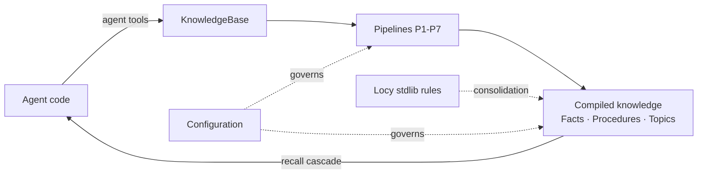

# Guides Overview

The [concepts](../concepts/architecture.md) section explains *how* uniko models memory.
These guides are the practical counterpart: they show how to drive the system from your own
Rust code — recording what an agent did, reasoning over compiled knowledge, and tuning the
behaviour that pipelines automate.

Every `observe` call does the compiling work for you with zero extra engineering per turn:
one atomic transaction stores the Message, chunks it, and extracts Entities and Observations
with local models — no LLM in the loop. Consolidation then compiles those Observations into
Facts, Procedures and Topics — call `agent.consolidate()` when you want it, or build with
`.streaming(true)` and let the worker schedule it. The guides below
cover the parts that remain *yours*: the knowledge only an agent can provide, the formal
reasoning that runs inside the database, and the knobs that govern the pipelines.

!!! note
    Everything here is a Rust API. uniko links into your process like an embedded library;
    there is no service to operate and no network hop between your agent and its memory.

### [Working with the Facade](facade.md)
The full tour of the `Uniko` facade — build, observe, recall/answer, retrieve, plan, and curate —
with the mental model that ties them together. Start here.

### [Agent Tools](agent-tools.md)
The supplement to the pipelines — goals and tasks via `agent.goals()`, plus `record_episode`,
`record_action`, `add_observation`, `assert_fact`, for knowledge an agent alone can give.

### [Recall & Retrieval](retrieval.md)
Reading memory back — `agent.recall`/`answer`, item `kind` + `sources` provenance, cited answers,
and dereferencing sources with `agent.data()`.

### [Reasoning with Locy](reasoning-with-locy.md)
The stdlib rules and database-native logic that turn repeated experience into
Procedures — plus how to write and invoke your own Locy rules.

### [Configuration](configuration.md)
The thresholds and cadences that govern ingest, consolidation, the cortex sweep, and the
recall cascade's coverage gates.

## Where the guides fit

**Agent tools** feed the graph the things pipelines cannot infer. Episodes are subjective —
the agent decides what is worth recording — and procedural memory only accumulates when
agents call `record_episode`. The richer the episode stream, the more the system improves
over time.

**Locy reasoning** is what makes consolidation more than aggregation. Three stdlib rules
ship registered and run each cortex sweep (`sequence_detector`, `episode_pattern_detector`,
`contradiction_detector`); a fourth, `relevance_decay`, runs in Rust. Procedure promotion
invokes `sequence_detector` during the cortex sweep — which fires once every
`cortex_every_n` successful consolidation cycles (default 4), not on every cycle — to turn
recurring action sequences into Procedures.

!!! note
    Procedure promotion invokes the `sequence_detector` Locy rule by name via a `QUERY`
    goal-query. The three registered stdlib rules run automatically each cortex sweep; the
    [Reasoning with Locy](reasoning-with-locy.md) guide shows how to invoke them and write
    your own.

**Configuration** externalises the cadences and thresholds the pipelines use — the
consolidation triggers and the recall coverage gates. The guide maps every knob on
`UnikoConfig` and documents the lower-level retrieval constants that stay compiled-in.
The cortex sweep throttles (`cortex_cycle_every_n_consolidations`, `cortex_min_interval_secs`)
live on `PipelineConfig` in `uniko-pipes`; the facade builds the pipeline with
`PipelineConfig::default()`, so those run on their built-in cadence.

## Suggested reading order

=== "Building an agent"

    1. [Agent Tools](agent-tools.md) — wire `record_episode` / `record_action` into your
       loop and track goals with `agent.goals()`.
    2. [Recall & Retrieval](retrieval.md) — `agent.recall`/`answer` and dereferencing sources.
    3. [Configuration](configuration.md) — set the consolidation and cortex cadences for
       your workload.
    4. [Reasoning with Locy](reasoning-with-locy.md) — understand what the stdlib rules do
       with the episodes you record.

=== "Tuning recall quality"

    1. [Configuration](configuration.md) — the Phase 1 (0.75) and Phase 2 (0.65) coverage
       thresholds and what they gate.
    2. [Recall & Retrieval](retrieval.md) — `agent.recall`/`recall_in` and the `ContextBundle`
       it returns.

!!! tip
    Procedural learning is opt-in and proportional to episode richness. If
    `phase1_only_pct` is not trending upward, the most common cause is too few recorded
    Episodes — start with [Agent Tools](agent-tools.md).
