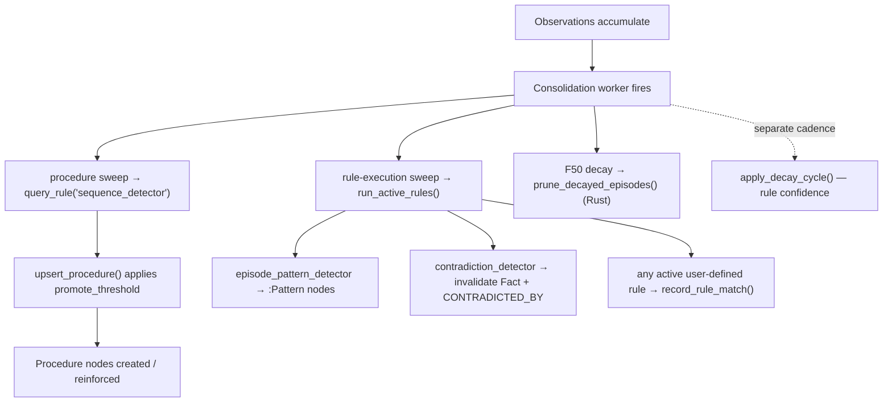

# Reasoning with Locy

Most memory systems can *retrieve* — they hand you back the rows that look like your
query. Far fewer can *reason* — derive a conclusion that was never stored verbatim, decay
old beliefs on a schedule, or ask "what would change if this fact were true?" without
mutating the graph.

uniko reaches for that second tier by embedding **Locy** — uni-db's logic-programming
layer — directly in the graph store. Rules are declarative `CREATE RULE … AS …` programs
that match patterns over your `Episode`, `Fact`, and `Participant` nodes and *yield*
derived bindings. They live in the same graph as your memory, run through the same engine
as your Cypher, and are managed by a confidence-driven lifecycle so a rule that stops
earning its keep eventually decays out.

This guide covers the Locy runtime surface in `uniko-store`, the four stdlib rules in
`uniko-memory`, how to write your own rules, and how procedure promotion uses them during
consolidation.

!!! note "Where the code lives"
    The Locy runtime wrapper is in `uniko-store` (`KnowledgeBase::create_rule`,
    `execute_rule`, `query_rule`, `assume`, `abduce`, …). The stdlib rules and their
    lifecycle state machine are in `uniko-memory` (`rules::stdlib`, `rules::lifecycle`).

## The Locy surface on `KnowledgeBase`

Every Locy capability is a method on [`KnowledgeBase`](../concepts/architecture.md). The
wrapper forwards to uni-db's `db.rules()` registry and the `session().locy_with(program)`
builder — uniko adds parameter threading, error mapping into `UnikoError::Locy`, and
ergonomic result extraction.

| Method | What it does |
|---|---|
| `create_rule(source)` | Register a Locy rule from source (a `CREATE RULE … AS …` statement). |
| `execute_rule(program, params)` | Run an inline Locy *program* and return result rows. |
| `query_rule(name, return_cols, params)` | Invoke a *registered* rule by name via a `QUERY <name> RETURN …` goal query. |
| `list_rules()` | List registered rules as `RuleInfo { name }`. |
| `delete_rule(name)` | Remove a rule from the runtime; returns `true` if it existed. |
| `explain_rule(program)` | Return the `Debug` rendering of runtime stats (developer diagnostic). |
| `assume(block)` | Begin a hypothetical-reasoning `AssumeBuilder`. |
| `abduce(program, params)` | Run an abductive program; collect supporting facts. |

!!! warning "`execute_rule` vs `query_rule`"
    `execute_rule` treats its argument as a Locy **program** — you cannot hand it a bare
    registered rule name, because uni-db parses that as a query and fails. To invoke a
    rule you registered with `create_rule`, use `query_rule`, which builds the
    `QUERY <name> [RETURN <cols>]` goal-query form for you. The `return_cols` must name the
    rule's `YIELD` aliases; result rows are keyed by those names.

A rule is a row-producing query whose body is normal pattern matching plus `FOLD`
aggregation and a `YIELD` projection:

```rust
use std::collections::HashMap;
use uniko_store::{KnowledgeBase, Value};

# async fn example(kb: &KnowledgeBase) -> uniko_store::Result<()> {
// Register a rule once (idempotent — registering an exact duplicate is a no-op).
kb.create_rule(
    "CREATE RULE successful_pairs AS \
     MATCH (e1:Episode)-[:FOLLOWED_BY]->(e2:Episode), \
           (e1)-[:RECORDED_BY]->(p:Participant {participant_id: $agent_id}) \
     WHERE e1.outcome = 'success' AND e2.outcome = 'success' \
     FOLD n = COUNT(*) \
     YIELD KEY e1.action_type AS action_a, KEY e2.action_type AS action_b, \
           n AS success_count",
)
.await?;

// Invoke it by name, naming the YIELD aliases as the columns to return.
let mut params = HashMap::new();
params.insert("agent_id".into(), Value::String("agent-1".into()));
let rows = kb
    .query_rule("successful_pairs", &["action_a", "action_b", "success_count"], &params)
    .await?;
# Ok(())
# }
```

!!! tip "Locy is not Cypher"
    Rule bodies use Locy syntax, which diverges from Cypher in ways that bite if you assume
    they're the same dialect:

    - Multiple relationships go in **one comma-joined `MATCH`** — a second `MATCH` clause is
      a parse error.
    - Aggregate result columns are written `expr AS name` — there is **no `VALUE` keyword**
      in that position.
    - A `$param` inside a post-`FOLD` `HAVING` does **not** resolve; push that filtering to
      the consumer instead.

    These three differences are easy to miss and are documented as RC12 in the project's
    uni-db workarounds notes — follow them and your rules register and run on the first try.

## Hypothetical reasoning — `ASSUME`

`assume` forks the graph state, applies mutations from the `ASSUME { … }` block, runs an
optional follow-up query against that hypothetical state, and rolls back — **the original
graph is never modified**. It answers "what would I see if this were true?" without
committing.

```rust
# async fn example(kb: &uniko_store::KnowledgeBase) -> uniko_store::Result<()> {
let rows = kb
    .assume("ASSUME { CREATE (:Fact {subject: 'server', predicate: 'port', object: '9090'}) }")
    .then_query("MATCH (f:Fact {subject: 'server'}) RETURN f")
    .run()
    .await?;
# Ok(())
# }
```

The `AssumeBuilder` chains `then_query(q)` to set the query and `param(key, value)` to
inject parameters; `run()` executes the fork-mutate-query-rollback cycle. The performance
target is under 200 ms (NF9).

## Abductive reasoning — `ABDUCE`

`abduce` runs an abductive Locy program — `ABDUCE <rule> WHERE …` asks "what changes to the
graph would satisfy this rule?" — and returns the ranked, validated modifications in an
`AbductionResult`:

```rust
pub struct AbductionResult {
    pub modifications: Vec<AbducedModification>,
}

pub struct AbducedModification {
    pub modification: serde_json::Value,
    pub validated: bool,
    pub cost: f64,
}
```

`modifications` holds each proposed graph change in the engine's ranked order. Per modification,
`validated` tells you whether applying it satisfies the goal, and `cost` is the ranking cost the
engine assigned — so you build on the cheapest validated modification first.

The `abduce` module also defines `DerivationTree` / `DerivationNode` types for explaining
how a rule reached a result.

## The stdlib rules

uniko ships four stdlib memory-maintenance rules. **Three are registered as Locy rules**
(`sequence_detector`, `episode_pattern_detector`, `contradiction_detector`);
`register_stdlib_rules(&kb)` is called at startup and is idempotent — it merges a `Rule`
node into the graph for each (`source_type = "stdlib"`, `confidence = 1.0`, `status =
"active"`) and registers the source in uni-db's Locy runtime. Stdlib rules are protected:
`is_stdlib_rule("stdlib")` returns `true`, and the lifecycle exempts them from decay,
demotion, and pruning.

The fourth, **`relevance_decay`, currently runs in Rust** (`KnowledgeBase::prune_decayed_episodes`)
rather than as a registered Locy rule — see the note below.

| Rule | Runs as | Purpose |
|---|---|---|
| `sequence_detector` | Locy (via procedure sweep) | Find recurring `(action_a → action_b)` pairs where both episodes succeeded; yield a `success_count`. |
| `episode_pattern_detector` | Locy + Rust consumer | Group episodes by `action_type` + `outcome`; surface patterns with `n >= 3`. Mean-importance (`> 0.3`) is computed by the Rust consumer (see below). |
| `contradiction_detector` | Locy + Rust consumer | Find episodes whose `outcome` contradicts a currently-valid `Fact` (`predicate = 'outcome_pattern'`); the consumer invalidates the fact and draws a `CONTRADICTED_BY` marker edge. |
| `relevance_decay` | **Rust** | Prune episodes whose age-decayed importance (`importance * exp(-rate * age_days)`) falls below a threshold. |

Each Locy rule is a **detector** (`YIELD` only); a **Rust consumer** performs the side
effect — `DERIVE` is additive-only (it can `CREATE` edges/nodes and `MERGE`, but cannot
`DELETE` or `SET` on an existing node), so deletes and BTIC invalidations live in Rust.

### `relevance_decay` runs in Rust

The decay formula is `importance * exp(-ln(2)/half_life_days * age_days)`, computed from the
immutable stored `importance`. It lives in `KnowledgeBase::prune_decayed_episodes`, invoked
each cortex sweep. The equivalent Locy rule is **not registered**: expressing it needs
`duration.inDays(...)` arithmetic, which uni-db currently rejects with `Unsupported CAST
from LargeBinary to Float64` — and because uni-db evaluates all registered rules together,
registering it would poison every rule query. Once that's fixed upstream the rule can move
back to Locy.

## How rules participate in consolidation

Consolidation (P4 — see [Consolidation](../pipelines/consolidation.md)) is uniko's
background heartbeat: the worker fires after a batch of observations accumulates or on a
timer. Two rule-driven activities hang off that cycle.



### Procedure promotion runs `sequence_detector`

The consolidation worker calls `promote_procedures_once(&kb, agent_id, cfg)` in
`uniko-cortex`. It invokes the registered rule via
`query_rule("sequence_detector", &["action_a", "action_b", "success_count"], …)` and turns
each recurring success pair into a `Procedure` node named `"{a} → {b}"`. The rule
deliberately surfaces **all** pairs with no `HAVING` filter; `upsert_procedure` applies the
`LifecycleConfig::promote_threshold` (default `3`) to decide candidate-vs-active.

### The rule-execution sweep runs every other active rule

`run_active_rules(&kb, agent_id, cfg)` (the rule-execution sweep, gated by
`PipelineConfig::run_rules_in_sweep`) runs every `active`/`candidate` `:Rule` that isn't
handled by a dedicated sweep. For the stdlib rules it dispatches to a Rust consumer
(`episode_pattern_detector` → upsert `:Pattern`; `contradiction_detector` → invalidate the
fact + draw `CONTRADICTED_BY`); for any **user-defined** rule it runs the rule and calls
`record_rule_match` on a hit. This is what makes the lifecycle bidirectional — a candidate
authored rule that binds a match is promoted, not just decayed.

### The rule lifecycle decays authored & induced rules

Authored and induced rules (not stdlib ones) move through a confidence-driven state
machine in `uniko-memory::rules::lifecycle`:

```text
add_rule()             validate              decay below 0.40
  │                       │                       │
  ▼                       ▼                       ▼
candidate ──(success)──▶ active ──(repromote ≥ 0.60)──▶ active
                         │                       │
                         └──(no match 90d)──▶ pruned
```

- `add_rule(kb, AddRuleParams { … })` validates the Locy source up front (a syntax error
  leaves **no** `Rule` node behind), then persists a `Rule` in `status = "candidate"` with
  default confidence `0.5`. Passing `source_type = "stdlib"` is rejected — stdlib goes
  through `register_stdlib_rules`.
- `apply_decay_cycle(kb, cfg)` runs from the cortex sweep (every `cortex_every_n` successful consolidation cycles, default 4) and is additionally globally throttled: it multiplies each
  non-stdlib rule's confidence by `decay_per_cycle`, bumps `missed_cycles`, and applies the
  state transitions — returning a `DecayReport { decayed, demoted, promoted, pruned }`.
- `record_rule_match(kb, name, cfg)` resets `missed_cycles`, bumps `last_scored_at`, and
  adds a `+0.05` confidence reward (capped at `1.0`) so repeatedly useful rules don't decay
  below the demotion threshold.

The defaults in `RuleLifecycleConfig` match the spec: `decay_per_cycle = 0.95`,
`demote_threshold = 0.40`, `repromote_threshold = 0.60`, `prune_after_days = 90`.

```rust
use uniko_memory::rules::{RuleLifecycleConfig, apply_decay_cycle, record_rule_match};

# async fn example(kb: &uniko_store::KnowledgeBase) -> Result<(), uniko_store::UnikoError> {
let cfg = RuleLifecycleConfig::default();

// A rule that bound matches this cycle gets rewarded and its miss-counter reset.
record_rule_match(kb, "my_authored_rule", cfg).await?;

// Every cycle, decay the rest and harvest the transitions.
let report = apply_decay_cycle(kb, cfg).await?;
println!("demoted={} pruned={}", report.demoted, report.pruned);
# Ok(())
# }
```

When a demoted or never-promoted rule goes `prune_after_days` without a match, it
transitions to the terminal `pruned` status; uniko best-effort removes it from the runtime
but keeps the `Rule` node for provenance.

## How the stdlib rules are wired

uniko registers the three Locy stdlib rules at startup, so you can invoke any of them by
name with `query_rule` — or run your own with `create_rule` / `execute_rule`. All three run
automatically each cortex sweep: `sequence_detector` via `promote_procedures_once`,
`episode_pattern_detector` and `contradiction_detector` via `run_active_rules`. The fourth,
`relevance_decay`, runs in Rust (`prune_decayed_episodes`). Entity drift and Rule confidence
decay run through the inline consolidation paths described in
[Facts & Drift](../concepts/facts-and-drift.md).

> **uni-db Locy notes (as of uni-db 2.4.1).** Registered rules share one evaluation, so every
> `query_rule` passes the union of all rules' parameters. A few Locy idioms to know:
> `duration.inDays(a, b)` returns a Temporal — use `.days` to get the integer day count
> (`relevance_decay` uses `duration.inDays(datetime(), e.timestamp).days`, which is a
> *negative* age for past episodes, so the formula is `exp(+rate · days)`); the reverse arg
> order yields `Null` inside arithmetic, so stick with `(datetime(), e.timestamp)`. Validity
> is checked with `f.invalidated_at IS NULL` (`btic.contains` is interval-vs-interval — it
> can't take a `datetime()` point). The one genuine bug we hit — `KEY` columns projecting
> `Null` without a `FOLD` ([#112](https://github.com/rustic-ai/uni-db/issues/112)) — was
> **fixed in 2.4.1**. The remaining Rust-side helper is `episode_pattern_detector`'s
> mean-importance, because `AVG(...)` in a post-`FOLD` HAVING filters out every group in the
> full-schema rule.

The runtime surface (`create_rule` / `query_rule` / `execute_rule` / `assume` / `abduce`) and
the rule lifecycle are fully implemented and tested.

## Related

<div class="feature-grid" markdown>
<div class="feature-card" markdown>
### [Consolidation](../pipelines/consolidation.md)
The background heartbeat that runs procedure promotion and the rule lifecycle.
</div>
<div class="feature-card" markdown>
### [Architecture](../concepts/architecture.md)
Where `KnowledgeBase` and the Locy runtime sit in the crate stack.
</div>
</div>
