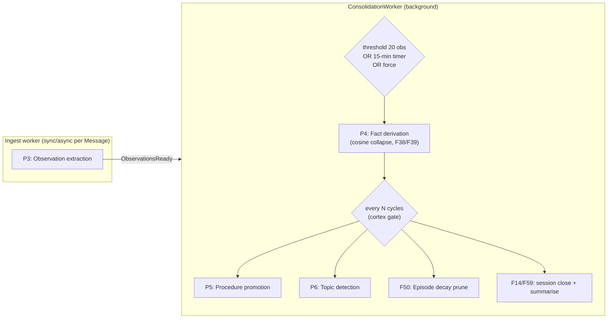
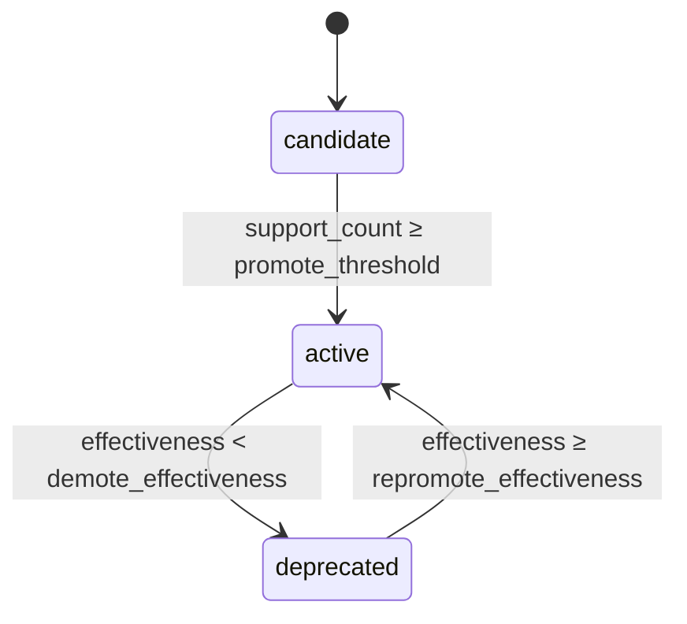

# Consolidation

Consolidation is where stored experience becomes knowledge. Ingest captures raw Observations —
single claims from single sources — but a claim echoed across five sessions is something stronger:
a stable, queryable `Fact`. Consolidation runs that cross-Observation work off the hot path: it
votes on the canonical form, stamps each Fact with a bitemporal validity interval, and retires
beliefs with provenance when newer evidence contradicts them. Run it on demand with
`agent.consolidate()`, or let a streaming instance schedule it — see
[How the worker schedules these passes](#how-the-worker-schedules-these-passes).

That cross-Observation work is **consolidation**: a set of background passes that
run *after* ingest, on their own cadence, off the hot path. They never block a
caller's `recall()`. This page covers the three reasoning passes that run there —
P4 fact derivation, P5 procedure promotion, P6 topic detection — and the worker
that schedules them under backpressure.



## How the worker schedules these passes

The `ConsolidationWorker` is a long-running Tokio actor with a single `select!`
loop. Its receiver is a bounded channel (`mpsc`). `submit_consolidation` uses
`try_send`, so a full queue is rejected immediately as
`UnikoError::Pipeline` rather than blocking the caller or growing without
bound. The loop is `biased`, checking in strict priority
order:

1. **Shutdown** — a `CancellationToken` fires; the worker logs and breaks.
2. **`ConsolidationTask`** — one of three triggers (below).
3. **Periodic timer** — only fires when nothing else is ready.

The ingest path sends `ConsolidationTask::ObservationsReady(ObservationsReady { agent_id,
observation_count, .. })` as new Observations land. The worker keeps a per-agent counter and
runs a cycle on **threshold-OR-timer**:

| Trigger | Condition |
|---|---|
| `ObservationsReady` | per-agent counter reaches `consolidation_threshold` (default 20), then resets |
| Periodic timer | every `consolidation_interval_secs` (default 900 = 15 min), for every agent with a non-zero counter |
| `ForceConsolidate` / `RunCycle` | immediate, on explicit request |

!!! tip "Two ways consolidation runs"
    **Explicitly** — `agent.consolidate()` runs one cycle on the calling task and returns
    `CycleStats`. Always available, no streaming required. This is the path to use when you
    want to decide the moment (end of a conversation, before a report, in a batch job).

    **Automatically** — an instance built with `.streaming(true)` owns a consolidation
    worker. Ingest notifies it as Observations land, and it fires on a per-agent threshold
    (20 new Observations) or a periodic timer (15 minutes), then runs the cortex sweep.

    A default (non-streaming) instance has no worker, so `consolidate()` is the only path
    there.

Each cycle calls `run_consolidation_cycle`, which delegates to
[`run_cycle`](#p4-fact-derivation). A failed cycle is **logged but never
propagated** — it records a failure on the `HealthTracker` and waits for the next
trigger. Per-item isolation is the rule everywhere in the pipeline: one bad cycle
never kills the worker.

!!! note "Tune how often heavy reasoning runs"
    P4 runs on every consolidation trigger. The heavier passes (P5, P6) plus decay and
    session maintenance run on a configurable **cortex gate**: `maybe_run_cortex_sweep`
    fires the sweep every `cortex_cycle_every_n_consolidations` cycles, subject to a minimum
    wall-clock gap of `cortex_min_interval_secs`. This decouples cheap fact derivation from
    heavy reasoning — tune it to your workload, or set
    `cortex_cycle_every_n_consolidations = 0` to disable the sweep.

Cortex failures are isolated the same way: they are logged but never propagate,
so consolidation stays healthy even when a downstream reasoning pass misfires.

---

## P4: Fact derivation

`run_cycle` derives Facts from unprocessed Observations. The mechanism, end to
end:

1. **Fetch** up to `batch_size` (default `DEFAULT_BATCH_SIZE = 500`) Observations
   that carry a structured triple (non-null `subject` and `predicate`) and have
   no inbound `PROCESSED` edge from a prior cycle.
2. **Group** by `(subject, predicate)`.
3. **Pick a canonical object** per group by *cosine-clustered* mode voting,
   tie-broken by recency.
4. **Upsert** one Fact per group, wiring `SUPPORTED_BY` edges from every
   contributing Observation.
5. **Detect contradictions** (F38) and **flag entity drift** (F39).
6. **Write** a `ConsolidationCycle` audit node whose `PROCESSED` edges are the
   idempotency anchor.

### Idempotency through `PROCESSED`

The query that fetches Observations excludes anything already wired via
`PROCESSED` from a previous `ConsolidationCycle`. That single invariant makes the
whole pass idempotent across runs: re-running consolidation never re-derives the
same Fact from the same Observation, and each `(Fact, Observation)` `SUPPORTED_BY`
edge is wired exactly once.

```rust
use uniko_memory::consolidation::{run_cycle, CycleStats};

// One cycle for an agent, default batch size.
let stats: CycleStats = run_cycle(&kb, "agent-1", None).await?;

println!(
    "processed={} created={} reinforced={} invalidated={} drift={}",
    stats.observations_processed,
    stats.facts_created,
    stats.facts_reinforced,
    stats.facts_invalidated,
    stats.drift_alerts,
);
```

### Cosine collapse: why mode voting clusters first

Naive mode voting over raw object strings splits the vote between near-duplicate
phrasings. If five Observations say "adoption agencies", "adoption agencies",
"adoption agency", "adoption agency", "foster care", an exact-string tally sees
three buckets of size 2/2/1 — and a recency tie-break can let the off-topic
"foster care" win.

So P4 votes in **cluster space**. Every unique object surface form (plus the
object of any prior open Fact for the group) is embedded in one batched call, and
keys are agglomerated greedily by cosine similarity:

- `COSINE_THRESHOLD = 0.88` — two surface forms at or above this are treated as
  paraphrases of one canonical claim. Tuned for BGE-small-en (the bench default):
  inflection/article variants land at 0.93+, genuinely different objects ("Rust"
  vs "Go") sit well below 0.7, so 0.88 is a safe split.
- Clusters use a single-pass greedy agglomeration with running-mean centroids,
  iterating keys in sorted order for deterministic cluster ids.
- When clustering is disabled (`consolidation_cluster_objects = false`) or an
  embedding is missing, each key falls back to its own singleton cluster —
  reproducing the legacy exact-string behaviour.

The canonical object is then the **mode over clusters**; within the winning
cluster, the mode over surface forms; ties broken by the most recent
`observed_at`.

!!! tip "Embedding is chunked, and failures degrade gracefully"
    Object and Fact embedding both go through a chunked batch call
    (`EMBED_BATCH_CHUNK_SIZE = 64`) to keep per-forward activation memory bounded
    — the unchunked path OOM'd the ORT arena at ~6k inputs. If a batch fails or
    returns the wrong length, the cycle logs a warning and degrades: object
    clustering falls back to exact-string dedup, and Facts are stored without an
    embedding rather than aborting the cycle.

### F38: contradiction detection

For each group, P4 looks up prior **open** Facts (a Fact's validity interval is a
[BTIC](../concepts/data-model.md) — bitemporal interval — whose `hi` is still
open) for the same `(subject, predicate)` in one batched query. A prior Fact is
invalidated when the votes that **disagree** with its object's cluster exceed the
threshold of the total:

```rust
const CONTRADICTION_THRESHOLD: f64 = 0.40;
```

When more than 40% of a group's Observations land outside the cluster containing
the prior Fact's object, that prior Fact is invalidated: its BTIC `hi` is closed
and an `INVALIDATES` edge is wired from the new Fact. Crucially, "different" means
*outside the cluster* — so a paraphrase-only change never triggers a spurious
invalidation.

### F39: entity drift

Every invalidation is recorded against the subject Entity's `invalidation_count`.
The unstable flag is **windowed**, not cumulative: `record_entity_invalidation`
counts the `INVALIDATES` edges within the last 30 days
(`DRIFT_WINDOW_DAYS = 30`) and flags the Entity unstable when *that windowed
count* exceeds the drift threshold:

```rust
const DRIFT_THRESHOLD: i64 = 4;
const DRIFT_WINDOW_DAYS: i64 = 30;
```

`record_entity_invalidation` sets `Entity.unstable = true` once more than 4
invalidations land within the trailing 30-day window (`invalidation_count` is
still incremented, but the flag is gated on the windowed count, not the
cumulative total), and the cycle counts it as a `drift_alert`. The recall cascade
reads that flag to force deeper retrieval phases for queries that reference an
unstable Entity.

!!! note "Triple source: SRL/DEP by default, LLM optional"
    Grouping uses the `predicate`/`object` columns P3 already stored on the
    Observation (the `TripleSource::SrlDep` default — no LLM dependency).
    `run_cycle_with` accepts `TripleSource::Llm { alias }` to refine each
    Observation's triple via a model call before grouping, which collapses
    near-duplicates the rule-based path leaves spread across distinct keys (e.g.
    "got" / "got_a" / "received" all collapsing to "received"). The LLM path
    falls back to the SRL/DEP triple whenever the model declines or its response
    fails to parse.

---

## P5: Procedure promotion

A `Procedure` captures a recurring, successful action sequence — "when
*investigate* succeeds it is often followed by *implement*" — so that recall and
planning can match against it.

`promote_procedures_once` runs the stdlib **`sequence_detector` Locy rule**, which
surfaces every recurring `(action_a → action_b)` pair where *both* Episodes
succeeded, with `success_count` as the occurrence count:

```text
MATCH (e1:Episode)-[:FOLLOWED_BY]->(e2:Episode),
      (e1)-[:RECORDED_BY]->(p:Participant {participant_id: $agent_id})
WHERE e1.outcome = 'success' AND e2.outcome = 'success'
FOLD n = COUNT(*)
YIELD KEY e1.action_type AS action_a, KEY e2.action_type AS action_b,
      n AS success_count
```

The rule itself has no `HAVING` filter — it surfaces *all* pairs. Classification
into candidate-vs-active is applied in Rust by `upsert_procedure` against the
lifecycle thresholds. Each pair becomes (or reinforces) a Procedure named
`"{action_a} → {action_b}"`, keyed by a deterministic `procedure_id` so re-runs
merge into the same node.

```rust
use uniko_cortex::procedures::{promote_procedures_once, LifecycleConfig};

let report = promote_procedures_once(&kb, "agent-1", LifecycleConfig::default()).await?;
println!(
    "created={} reinforced={} promoted={}",
    report.created, report.reinforced, report.promoted,
);
```

### Lifecycle (F41/F42/F43)



The thresholds, from `LifecycleConfig::default()`:

| Field | Default | Meaning |
|---|---|---|
| `promote_threshold` | `3` | sequence count to promote a candidate to `active` |
| `demote_effectiveness` | `0.4` | effectiveness below which an `active` Procedure is demoted |
| `repromote_effectiveness` | `0.6` | effectiveness above which a `deprecated` Procedure returns to `active` |

Effectiveness is `success_count / (success_count + failure_count)`. The two
effectiveness bounds differ on purpose — the gap gives hysteresis so a Procedure
that briefly dipped isn't flapped between states.

`promote_procedures_once` only ever promotes candidates that cross the support
threshold. Demotion and repromotion are owned by `record_procedure_use`, which
bumps a Procedure's `use_count` / `success_count` / `failure_count` after a real
attempt and re-applies the state machine. `match_procedures` returns the `active`
Procedures whose `precondition_rule` matches a given state — an empty precondition
matches any state; otherwise it is a comma-separated list of `key=value` clauses
that must all be present.

!!! note "Locy-backed"
    P5's sequence detection invokes the `sequence_detector` Locy rule **by name**
    via `query_rule` — a real goal-query (`QUERY sequence_detector RETURN ...`)
    evaluated by Locy, with no Cypher shim in the path. See
    [Reasoning with Locy](../guides/reasoning-with-locy.md) for the full picture.
    `episode_pattern_detector` and `contradiction_detector` are also registered and
    run automatically each cortex sweep via `run_active_rules` (each backed by a Rust
    consumer). `relevance_decay` runs in Rust (`prune_decayed_episodes`), not as a
    Locy rule — uni-db can't yet plan its `duration.inDays(...)` arithmetic. The
    precondition matcher is a `key=value` evaluator, not a full Locy WHERE engine.

---

## P6: Topic detection

A `Topic` groups Entities that travel together — a detected community over the
Entity **co-occurrence graph**. Two Entities are linked when they appear together
in the same Message, Chunk, Episode, Action, or Artifact (via `MENTIONS`).
Communities of size ≥ 2 become Topic nodes; members are wired by `BELONGS_TO`.

`detect_topics_once` runs **weighted Label Propagation (LPA)**. Each Entity starts
in its own community; on each sweep, every Entity adopts the highest-weighted
community label among its neighbours, ties broken by the smaller label id for
deterministic convergence. It is linear per iteration and converges in a handful
of sweeps.

```rust
use uniko_cortex::topics::{detect_topics_once, TopicConfig};

let report = detect_topics_once(&kb, TopicConfig::default()).await?;
println!(
    "created={} updated={} entities_assigned={}",
    report.created, report.updated, report.entities_assigned,
);
```

`TopicConfig::default()`:

| Field | Default | Meaning |
|---|---|---|
| `min_community_size` | `2` | smallest community that becomes a Topic; singletons are always skipped |
| `max_iterations` | `10` | LPA sweeps before convergence is forced |
| `max_pairs` | `100_000` | hard cap on co-occurrence pairs pulled for projection |

Each surviving community gets a deterministic `topic_id` derived from its sorted
member set, so re-runs are idempotent and `merge_node` / `merge_belongs_to_edges`
refresh rather than duplicate. A Topic's `embedding` is the mean-pool of member
embeddings (nullable — search just skips a Topic with no member embeddings), and
its `summary` buckets members by Kniv `entity_type`.

By default the Topic name is the deterministic join of up to three member names.
Naming is cosmetic: an optional LLM alias can produce a nicer name via
`detect_topics_once_with_llm`, but any failure — or building without the `llm`
feature — falls back silently to the deterministic name and never blocks a sweep.

!!! note "LPA over Louvain"
    Louvain is available in uni-db via `CALL uni.algo.louvain(...)`. P6 defaults to
    LPA because it avoids materialising a graph projection and is simple to reason
    about; the comment in `topics.rs` notes Louvain as the choice once the Entity
    count grows past ~50K entities.

---

## Cycle outputs and observability

Every successful P4 cycle returns `CycleStats` and writes a `ConsolidationCycle`
audit node with `PROCESSED`, `CREATED`, and `INVOLVED` edges. The worker emits
metrics around each pass:

| Metric | Pass |
|---|---|
| `uniko.consolidation.cycles_total` | P4 cycle start |
| `uniko.consolidation.duration_ms` | P4 |

Only `uniko.consolidation.cycles_total` and `uniko.consolidation.duration_ms`
actually fire. The `uniko.consolidation.facts_derived` / `facts_invalidated`
metrics are registered/described but **not emitted**; the per-cycle fact counts
are instead available on the returned `CycleStats` (`facts_created`,
`facts_invalidated`, etc.).

P5 and P6 emit their own cycle and duration metrics plus promotion/creation
counters, namespaced under `uniko.cortex.*` (e.g.
`uniko.cortex.procedure_cycles_total`, `uniko.cortex.topic_cycles_total`) — not
`uniko.consolidation.*`. All passes are instrumented with `tracing`, so a single
agent's consolidation cycle is filterable in structured logs.

## Related pages

- [Ingest pipeline](ingest.md) — where Observations come from (P1–P3).
- [Data model](../concepts/data-model.md) — the BTIC intervals F38 closes.
- [Recall](recall.md) — how derived Facts, Procedures, and Topics surface to a query.
