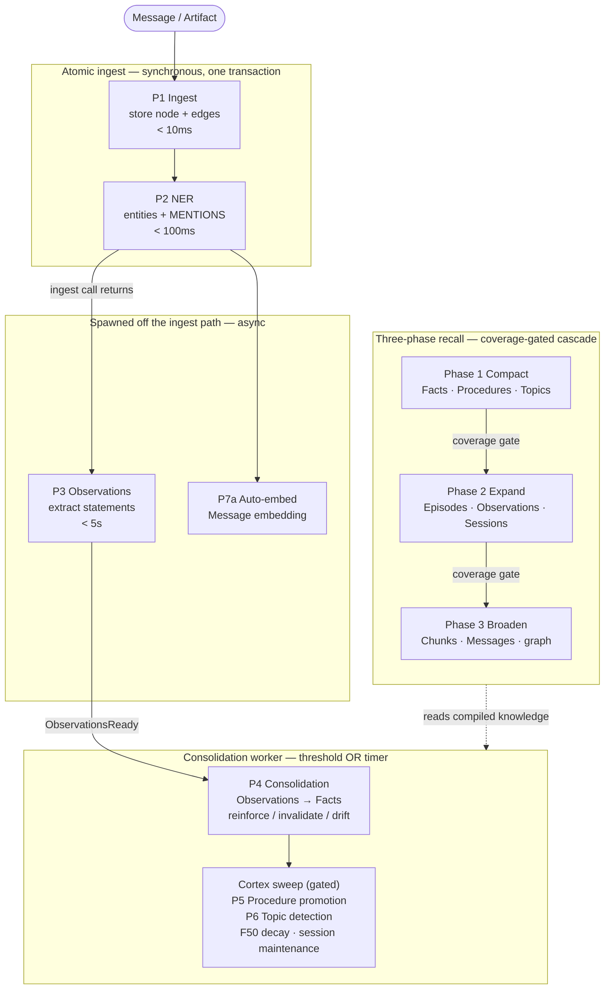

# Pipelines Overview

uniko keeps your agent responsive while its knowledge compounds. Writing a `Message` returns
in milliseconds with its Entities and Observations already extracted; the cross-message work —
deriving Facts, promoting Procedures, naming Topics — runs on its own cadence and never blocks
the turn the agent is in the middle of. Every pipeline runs in-process: there is no separate service to deploy and no queue to
operate.

uniko splits that work into three movements, each with a different cost profile and a different
sense of urgency:

1. **Atomic ingest** — synchronous, single-transaction storage of a `Message`,
   its entities, and its structural edges. Returns in milliseconds.
2. **Async post-ingest** — observation extraction and embedding spawned off the
   ingest path, plus a worker-driven *consolidation* cycle (and a *cortex sweep*:
   procedure promotion, topic detection, decay, session maintenance) triggered by
   a threshold or a timer.
3. **Three-phase recall** — a coverage-gated cascade that reads the *compiled*
   knowledge first and only broadens to raw content when it has to.



!!! note "uniko is an embedded Rust library"
    Every pipeline runs in-process inside your application. There is no separate
    service to deploy.

    The orchestration layer is [`PipelineSystem`](#orchestration-the-pipelinesystem)
    in `uniko-memory` — but it is constructed **only** when the instance was built
    with `.streaming(true)`. On a default instance there are no background workers at
    all: `session.observe()` does its work synchronously on the caller's task.

## What runs when

The data flow spans eight numbered pipeline stages. What matters operationally
is *who drives each one* — the calling thread, a spawned task, or a background
worker reacting to a trigger.

| Stage | Driver | Timing |
|---|---|---|
| **P1 Ingest** — store `Message`/`Artifact`, chunk, create edges | Synchronous (caller's task) | &lt; 10ms (message), &lt; 100ms (artifact) |
| **P2 NER** — extract `Entity` nodes + `MENTIONS` edges | Synchronous (caller's task) | &lt; 100ms |
| **P3 Observations** — extract factual statements | Synchronous (caller's task) | &lt; 5s |
| **P7a Auto-embed** — embed the `Message` | Synchronous, inside the same write | continuous |
| **P4 Consolidation** — derive `Fact`s, reinforce, invalidate, detect drift | `agent.consolidate()`, or the consolidation worker when streaming | on demand, or threshold/timer |
| **P5 Procedure promotion** — recurring sequences → `Procedure`s | Cortex sweep, after a consolidation cycle | post-consolidation |
| **P6 Topic detection** — entity co-occurrence → `Topic`s | Cortex sweep, after a consolidation cycle | post-consolidation |

P1, P2, P3 and P7a are not separate stages at runtime — they are phases of
`ingest_message_atomic`, which runs all the CPU work first and then writes the Message,
Chunks, Entities, `MENTIONS`, Observations, `OBSERVED_IN` and `ABOUT` in **one
transaction**. `observe()` returns only after that transaction commits, which is what makes
the write read-after-write consistent.

!!! tip "Two ways consolidation runs"
    **Explicitly** — `agent.consolidate()` runs one cycle on the calling task and returns
    `CycleStats`. Always available, no streaming required. This is the path to use when you
    want to decide the moment (end of a conversation, before a report, in a batch job).

    **Automatically** — an instance built with `.streaming(true)` owns a consolidation
    worker. Ingest notifies it as Observations land, and it fires on a per-agent threshold
    (20 new Observations) or a periodic timer (15 minutes), then runs the cortex sweep.

    A default (non-streaming) instance has no worker, so `consolidate()` is the only path
    there.

!!! tip "Compile once, query forever"
    Consolidation compiles raw Messages and Observations into Facts and Procedures once. The
    recall cascade queries that compiled knowledge first, so extraction is paid once at write
    time and amortized across every read — never re-derived per query.

## Atomic ingest

There are no separate P1/P2/P3 `Step`s at runtime. The workspace has exactly one
production `Step` implementation — `IngestStep` — and the chain the facade builds is a
one-element vector. The stage numbers describe *phases within*
`ingest_message_atomic`: it does all NLP/NER/SRL and read-only lookups first, then opens a
single transaction that writes the `Message` (or `Artifact`) with its structural edges,
Chunks, Entities, `MENTIONS`, Observations, `OBSERVED_IN` and `ABOUT`, and commits once.

Because it is one transaction, a message is either fully stored with its entities and
observations or not stored at all — there is no half-ingested state visible to a query.

On the streaming path each item flows through a chain of `Step`s (today: just
`IngestStep`). Steps declare their own error policy via `StepErrorPolicy`, so a failure is
contained to a single item and a single step:

- `Skip` — log and continue to the next step (e.g. NER failing still leaves a
  stored Message).
- `DeadLetter` — persist a `DeadLetter` node for later retry, then continue.
- `Abort` — stop the remaining steps for this one item only.

Concurrency is bounded by a `Semaphore` (default 8), and the worker pulls from a
bounded channel (capacity 200), so backpressure propagates to the caller rather
than growing an unbounded queue.

→ Read more in **[Ingest](ingest.md)**.

## Async post-ingest: consolidation and the cortex sweep

The **ConsolidationWorker** consumes `ConsolidationTask`s. Its designed trigger is a
**threshold-OR-timer** rule driven by an `ObservationsReady` notification that increments a
per-agent counter:

- **20 new Observations** accumulate for an agent (`consolidation_threshold`), or
- the periodic timer ticks (`consolidation_interval_secs`, default 900s / 15 min)
  with any pending Observations,

whichever comes first. `ForceConsolidate` and `RunCycle` tasks trigger a cycle immediately.

!!! note "Who sends `ObservationsReady`"
    The ingest path emits it as Observations land: `Session::observe` sends it directly, and
    the ingest worker sends it for streamed `submit`s (attributing them to the agent carried
    on the task). Both are best-effort — a full consolidation queue is logged and dropped
    rather than failing an ingest that already committed.

    On a **non-streaming** instance there is no worker to receive it, so nothing accumulates;
    use `agent.consolidate()` there.

A consolidation cycle (P4) derives `Fact`s from unprocessed `Observation`s,
reinforces or invalidates existing Facts, detects drift, and records a
`ConsolidationCycle` audit node. After a *successful* cycle, the worker runs
the **cortex sweep** when both gates allow, governed by two independent throttles:

- a per-agent cycle counter (`cortex_cycle_every_n_consolidations`, default 4), and
- a per-sweep wall-clock minimum (`cortex_min_interval_secs`, default 600s).

When both gates allow, the sweep runs six passes in order: P5 procedure promotion (per
agent), P6 topic detection (global), F50 memory decay (prune age-decayed `Episode`s),
stdlib rule execution, rule-confidence decay (globally throttled, not once per cycle), and
session maintenance (auto-close inactive `Session`s and summarise them).

!!! tip "Background reasoning is isolated"
    Procedure promotion, topic detection, decay, and session maintenance run *after*
    consolidation succeeds. A failure in any of them is logged and isolated — it never breaks
    consolidation or the write path. Background reasoning is enrichment, not a critical path.

→ Read more in **[Consolidation](consolidation.md)**.

## Three-phase recall

`recall()` searches across every memory layer but tries to do the *least* work
that still answers the query. It runs a coverage-gated cascade:

=== "Phase 1 — Compact"

    Searches the **compiled** tiers: `Fact`, `Procedure`, `Topic`. This is the
    cheapest path. If coverage clears the Phase 1 gate (default 0.75), the
    cascade can stop here.

=== "Phase 2 — Expand"

    Episodic recall: vector search over `Episode`, `Observation` and `Message`,
    plus fulltext over `Message` and `Observation` content, with MMR
    deduplication. Gated at a
    lower coverage threshold (default 0.65).

=== "Phase 3 — Broaden"

    Raw content and graph traversal: `Chunk` and `Observation` search plus
    entity-link traversal. Phase 3 **always completes** — there is no early exit.

!!! tip "Recall sharpens as you ingest"
    Until consolidation has produced Facts, Procedures, and Topics, queries route through
    Phase 3 over raw content. As you ingest, the system shifts toward compiled-knowledge
    retrieval: `phase1_only_pct` rises and recall gets cheaper and sharper the more the
    knowledge base learns. This learned-index effect is structural and intentional.

The coverage score blends facet coverage, mean result score, and tier diversity:

```
coverage = 0.4 * facet_coverage + 0.3 * mean_score + 0.3 * diversity
```

A **drift override** forces Phase 2+ execution even when Phase 1 coverage is
sufficient, whenever the query references an Entity that consolidation has
flagged unstable (F39), via the F58 drift override — so questions about unstable
entities always re-check recent episodic evidence.

→ Read more in **[Recall](recall.md)**.

## Orchestration: the PipelineSystem

`PipelineSystem` owns the bounded channels, the LLM circuit breaker, the
dead-letter queue, and the worker join handles. It is created once and spawns
both workers immediately:

```rust
use std::sync::Arc;
use uniko_pipes::PipelineConfig;
use uniko_store::{KnowledgeBase, config::UnikoConfig};
use uniko_memory::pipeline::PipelineSystem;

let kb = Arc::new(KnowledgeBase::in_memory(UnikoConfig::default()).await?);
let ps = PipelineSystem::new(PipelineConfig::default(), kb, vec![]);

// ... submit ingest / consolidation tasks ...

ps.shutdown().await?;
```

Both workers run a `tokio::select!` loop with `biased` priority ordering:
shutdown first, then queued tasks. The **consolidation worker** adds a periodic
timer arm at the lowest priority; the ingest worker has no timer arm (only
shutdown + `rx.recv()`). This is what guarantees an interactive `recall()` is
never starved behind a consolidation cycle. Submitting a task is non-blocking:

```rust
ps.submit_ingest(task)?;            // backpressure if the channel is full
ps.submit_consolidation(task)?;
```

Health is observable per worker, including the circuit-breaker state:

```rust
let health = ps.health();
println!("ingest queue depth: {}", health.ingest.queue_depth);
println!("llm circuit: {:?}", health.llm_circuit);
```

!!! tip "Offline operation"
    NER, observation extraction, consolidation, and recall all function without
    an LLM. When the LLM provider fails, the circuit breaker opens so
    LLM-dependent work stops hammering a dead provider, and probes until it
    recovers. Note NER and observation extraction are not LLM-dependent at all:
    their rule-based fallbacks trigger when the ONNX cascade is unavailable, not
    from the breaker.

## Dive deeper

<div class="feature-grid" markdown>
<div class="feature-card" markdown>
### [Ingest](ingest.md)
Atomic single-transaction storage — P1 store, P2 NER, spawned P3/P7a, step error policies, and the IngestWorker.
</div>
<div class="feature-card" markdown>
### [Consolidation](consolidation.md)
Threshold-or-timer cycles that compile Observations into Facts, plus the gated cortex sweep: procedures, topics, decay, sessions.
</div>
<div class="feature-card" markdown>
### [Recall](recall.md)
The coverage-gated three-phase cascade — Compact, Expand, Broaden — with drift override and the phase1_only scaling signal.
</div>
</div>
